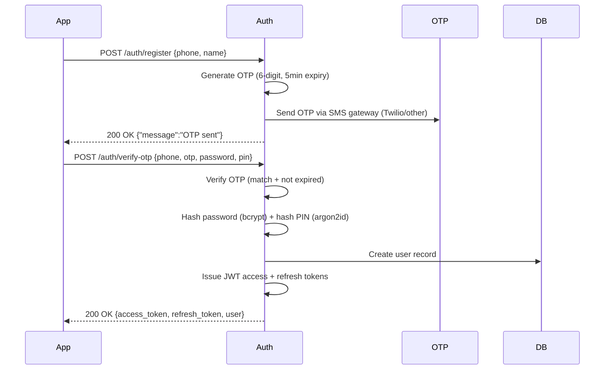
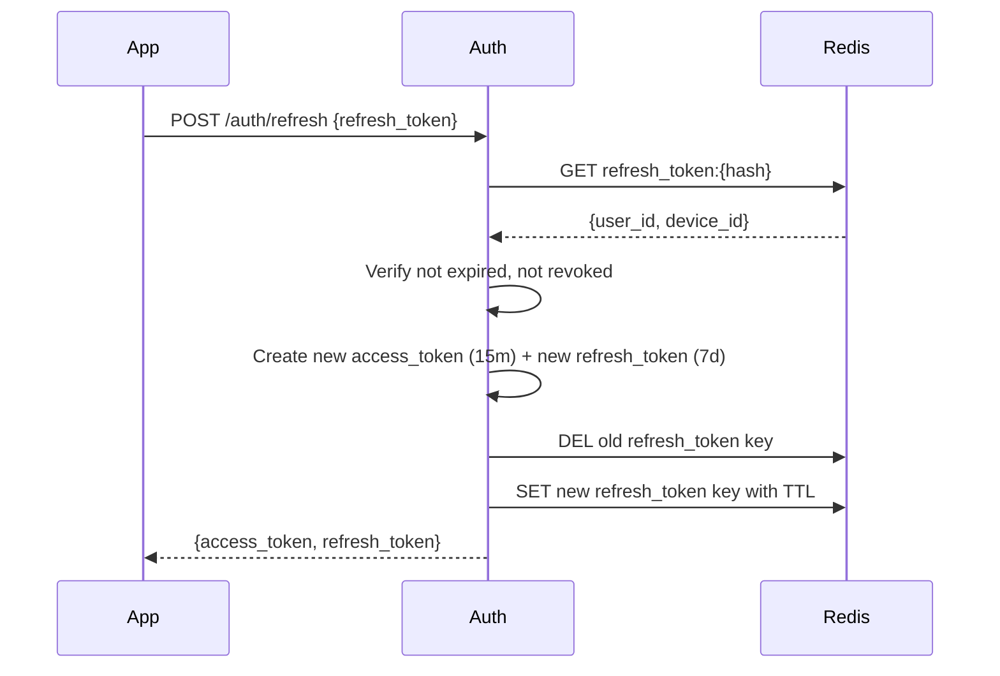

# 🔑 API Authentication Flow Specification

**Audience:** Mobile developers (Flutter), backend auth engineers  
**Last Updated:** 2026-05-07  
**Status:** Draft — needs security review

---

## 1. Overview

This document details all authentication and authorization flows, including login/registration, device trust, token management, and session security.

**Key Endpoints:**
- `POST /auth/initiate` — Check phone status and device trust.
- `POST /auth/register` — New user registration (sets password + PIN).
- `POST /auth/verify-otp` — Verify OTP for registration or login.
- `POST /auth/verify-password` — Validate password for untrusted devices.
- `POST /auth/verify-pin` — Fast login for trusted devices.
- `POST /auth/refresh` — Refresh access token.
- `POST /auth/change-pin` — Update transaction PIN.

---

## 2. Device Fingerprinting

### 2.1 Fingerprint Composition

Mobile app collects these signals on every login:

| Signal | Source | Format | Purpose |
|---|---|---|---|
| `device_id` | Local storage (Flutter `shared_preferences`) | UUID v4 | Unique persistent device identifier |
| `user_agent` | `dart:io` Platform.operatingSystem + version + app version | String | Detect OS/app updates |
| `ip_subnet` | Server reads client IP from request | CIDR /24 (masked) | Approximate location consistency |
| `app_version` | `package_info` plugin | Semver string | Identify outdated app |
| `install_ts` | First-run timestamp stored locally | Unix timestamp (ms) | Age of install (bot detection) |
| `last_login_ts` | Last successful login timestamp (server returns) | Unix timestamp (ms) | Recency of use |

**Client sends:** 
```json
{
  "device_id": "550e8400-e29b-41d4-a716-446655440000",
  "user_agent": "Android/14 (Pixel 6) PPOB/1.2.3",
  "app_version": "1.2.3",
  "install_ts": 1700000000000,
  "last_login_ts": 1704500000000
}
```

**Server calculates** `fingerprint_hash = SHA256(device_id || user_agent || app_version || install_ts)` and stores/updates in `device_fingerprints` table.

---

## 3. Trust Score Calculation

**Score (0–100) Components:**

| Signal | Max Points | Conditions |
|---|---|---|
| Device seen before on this account | +30 | `device_fingerprints` has row for `(user_id, device_id)` |
| Same IP subnet as recent logins | +20 | Compare current `ip_subnet` to last 3 login IPs (stored in `login_history`?) |
| App version current (within 1 minor) | +10 | App checks `latest_version` from `/app/version` endpoint |
| Install age > 7 days | +10 | `now() - install_ts > 7d` |
| Last login < 24h ago | +20 | `last_login_ts` within 24h |
| ≥3 previous successful logins on this device | +10 | Count successful logins from this `device_id` |

**Thresholds:**
- **Trusted (score ≥ 70):** Skip OTP; direct PIN login
- **Semi-trusted (30 ≤ score < 70):** Require password + OTP
- **Untrusted (score < 30):** Full password + OTP + possible additional challenge (CAPTCHA future)

**Storage & Update:**
```sql
-- On each login attempt, compute score and update device_fingerprints
UPDATE device_fingerprints 
SET 
    trust_score = $1,
    is_trusted = $1 >= 70,
    last_seen = NOW()
WHERE device_id = $2 AND user_id = $3;
```

If no existing row, insert new with score based on first login (likely low initially; builds with usage).

---

## 4. Registration Flow



**Step 1 — Register:**
```http
POST /auth/register
Content-Type: application/json

{
  "phone_number": "+6281234567890",
  "name": "John Doe"
}
```

**Response:**
```json
{
  "message": "Kode OTP telah dikirim ke nomor Anda"
}
```

**OTP Generation:**
- 6-digit random numeric (000000–999999)
- Store hashed (bcrypt) in `otp_codes` table with `phone_number`, `expires_at = NOW()+5min`, `attempts=0`
- Send via SMS provider (Twilio, AWS SNS, or local Indonesian provider like Xtrememyth)
- Rate limit: 3 OTP sends per hour per phone number

**Step 2 — Verify OTP & Set Credentials:**
```http
POST /auth/verify-otp
Content-Type: application/json

{
  "phone_number": "+6281234567890",
  "otp_code": "123456",
  "password": "StrongPass123!",
  "pin": "123456"
}
```

**Validation on Server:**
1. Find `otp_codes` where `phone_number` matches, `expires_at > NOW()`
2. Verify `bcrypt.CompareHashAndPassword(storedHash, otp_code)` (yes, hash OTP too)
3. Check `attempts < 3`; on failure, increment attempts; if attempts=3, delete OTP
4. Validate password strength (min 8, upper, lower, digit)
5. Validate PIN format (6 digits, not sequential)
6. If all OK:
   - Hash password with bcrypt(cost=12) → `password_hash`
   - Hash PIN with argon2id(memory=64MB, iter=2, p=1, salt) → `pin_hash`
   - Store `pin_salt` separately (needed for verification)
   - Create `users` row (`is_active=true`)
   - Assign default role `Mitra` in `user_roles` (trigger creates main wallet)
   - Delete OTP record
   - Generate JWT access token (15min) + refresh token (random 256-bit, stored hashed in Redis)
   - Log audit `user_created`
   - Return tokens

**Response:**
```json
{
  "access_token": "eyJhbGciOiJSUzI1NiIsInR5cCI6IkpXVCJ9...",
  "refresh_token": "random256bitstring",
  "token_type": "Bearer",
  "expires_in": 900,
  "user": {
    "user_id": "uuid",
    "phone_number": "+6281234567890",
    "name": "John Doe",
    "roles": [{"role_id":"...", "role_name":"Mitra"}],
    "active_role": {"role_id":"...", "role_name":"Mitra"}
  }
}
```

**Mobile stores:**
- `access_token` in memory (not persisted)
- `refresh_token` in encrypted Hive box (key derived from user PIN? or device-specific key)

---

## 5. Login Flow (Unified Endpoint)

**Single endpoint:** `POST /auth/login`

**Request:**
```json
{
  "phone_number": "+6281234567890",
  "password": "StrongPass123!",
  "pin": "123456",
  "device_fingerprint": {
    "device_id": "uuid",
    "user_agent": "...",
    "app_version": "1.2.3",
    "install_ts": 1700000000000,
    "last_login_ts": 1704500000000
  }
}
```

**Server-Side Adaptive Flow:**

```go
func Login(ctx context.Context, req LoginRequest) (*LoginResponse, error) {
    // 1. Find user by phone
    user, err := userService.GetByPhone(req.PhoneNumber)
    if err != nil || !user.IsActive {
        return nil, ErrInvalidCredentials // don't leak existence
    }

    // 2. Verify password (bcrypt)
    if err := bcrypt.CompareHashAndPassword(user.PasswordHash, []byte(req.Password)); err != nil {
        logAuditFailedLogin(user.ID, req.DeviceID, "password_mismatch")
        return nil, ErrInvalidCredentials
    }

    // 3. Compute trust score from device fingerprint
    trustScore := computeTrustScore(user.ID, req.DeviceFingerprint)
    deviceTrustLevel := classifyTrust(trustScore)

    // 4. Determine required auth step
    switch deviceTrustLevel {
    case Trusted:
        // Only need PIN
        if err := verifyPIN(user.PinHash, user.PinSalt, req.PIN); err != nil {
            // Wrong PIN, track attempts
            if incrementPinFailCount(user.ID) >= 5 {
                lockUser(user.ID)
                return nil, ErrAccountLocked
            }
            return nil, ErrInvalidPIN
        }
        resetPinFailCount(user.ID)
        
    case SemiTrusted:
        // Need password (already verified above) + OTP
        if !verifyOTP(req.PhoneNumber, req.OTP) {
            return nil, ErrInvalidOTP
        }
        // Also verify PIN
        if err := verifyPIN(user.PinHash, user.PinSalt, req.PIN); err != nil {
            return nil, ErrInvalidPIN
        }
        
    case Untrusted:
        // Already provided password; need OTP; also PIN
        if !verifyOTP(req.PhoneNumber, req.OTP) {
            return nil, ErrInvalidOTP
        }
        if err := verifyPIN(user.PinHash, user.PinSalt, req.PIN); err != nil {
            return nil, ErrInvalidPIN
        }
        // Flag: may set requirement for password reset if first login from new country?
    }

    // 5. Authentication successful — create session (JWT)
    accessToken, refreshToken, err := tokenService.CreateSession(user.ID, req.DeviceID)
    if err != nil {
        return nil, ErrSystemInternal
    }

    // 6. Update/insert device fingerprint
    upsertDeviceFingerprint(user.ID, req.DeviceFingerprint, trustScore)

    // 7. Log successful login (audit)
    auditLog(user.ID, "login_success", map[string]interface{}{
        "device_id": req.DeviceID,
        "trust_score": trustScore,
        "trust_level": deviceTrustLevel,
    })

    // 8. Return response
    return &LoginResponse{
        AccessToken:  accessToken,
        RefreshToken: refreshToken,
        ExpiresIn:    900, // 15min
        User:         userProfile,
    }, nil
}
```

**Why single endpoint?** Client doesn't need to decide which flow; server computes trust and requires accordingly. Simpler API.

---

## 6. Device Trust Management

### 6.1 Trust Score Re-evaluation

On every login:
- Recalculate score using latest data
- Update `device_fingerprints` row
- If score crosses threshold (e.g., from trusted → untrusted due to suspicious IP), require extra verification next login
- If score improves (e.g., install age >7d), upgrade trust automatically

### 6.2 Trust Revocation

Events that reset trust:
- Password changed
- PIN changed
- Account recovery initiated
- Suspicious activity detected (multiple failed logins from different countries)
- Inactive >30 days → trust_score set to 0 on next login

**Manual Revoke:** User can view trusted devices in profile and revoke any; that device's next login treated as untrusted.

---

## 7. Token Lifecycle

### 7.1 JWT Claims

```json
{
  "sub": "user-uuid",
  "role": "active-role-uuid",
  "roles": ["role-uuid-1", "role-uuid-2"],
  "wallet_id": "active-wallet-uuid",
  "device_id": "device-fingerprint-uuid",
  "iat": 1704556800,
  "exp": 1704571200,
  "jti": "jwt-unique-id"
}
```

**Claims meaning:**
- `sub` — user identifier (subject)
- `role` — currently active role UUID
- `roles` — all roles user possesses (array)
- `wallet_id` — wallet associated with active role
- `device_id` — which device this token issued to
- `jti` — unique token ID (for revocation blocklist)

### 7.2 Refresh Token Rotation

**Storage:** Redis hash `refresh_token:{jti}` → `{user_id, device_id, expires_at}` with TTL=7d.

**Flow:**
```http
POST /auth/refresh
Authorization: Bearer <old-refresh-token>
```

Server:
1. Hash old refresh token → lookup in Redis `refresh_token:{hash}`
2. If found and not expired → issue new access + new refresh token
3. Delete old refresh token entry (one-time use)
4. Store new refresh token (hash → metadata) with new TTL
5. Return new tokens

**Compromise Protection:** If refresh token stolen and used from different device, original device's token becomes invalid (single-use semantics). User re-login on original device will fail; they can use password+OTP to recover.

---

## 8. Password & PIN Reset

### 8.1 Forgot Password

```http
POST /auth/forgot-password
{ "phone_number": "+6281234567890" }
```

→ Send OTP to phone (same OTP system).
User enters OTP + new password → server sets new `password_hash` and invalidates all existing sessions (delete all refresh_tokens for user).

### 8.2 Change PIN

Requires re-authentication (current PIN OR password+OTP if device trusted):

```http
POST /auth/change-pin
Authorization: Bearer <access_token>
{
  "current_pin": "123456",          // OR
  "password": "StrongPass123!",
  "otp_code": "654321",             // if using password fallback
  "new_pin": "654321",
  "confirm_pin": "654321"
}
```

Server:
- Verify current PIN (if provided) OR verify password + OTP
- Hash new PIN with fresh argon2id salt
- Update `users.pin_hash` and `users.pin_salt`
- Invalidate all refresh tokens (force re-login on all devices) as security precaution
- Audit log `pin_changed`

---

## 9. Role Switching

**Endpoint:** `POST /users/switch-role`

**Request:**
```json
{
  "role_id": "uuid-of-staff-or-mitra-role"
}
```

**Prerequisites:**
- User must have that role in `user_roles`
- If switching to Staff, verify assigned_by Mitra still exists (Mitra not deleted)
- Cannot switch to a role that is inactive (role `is_active` flag)

**Server Actions:**
1. Validate role belongs to user
2. Look up `wallets` table for wallet owned by user (`owner_id = user_id`)
3. Ensure wallet exists (should on role assignment)
4. Update `users.active_role_id` (or no column — returned in JWT)
5. Issue **new access token** with updated `role` and `wallet_id` claims (do not mutate existing token; let it expire)
6. Return `new_access_token` (and optionally new refresh token? No, keep refresh token; only access token changes)

**Response:**
```json
{
  "access_token": "new-jwt-with-role",
  "expires_in": 900,
  "active_role": {"role_id":"...", "role_name":"Staff"},
  "wallet_id": "staff-wallet-uuid"
}
```

**Mobile:** Replace stored access token; no need to re-login.

---

## 10. Token Revocation & Logout

**Logout:** Client discards tokens; server removes refresh token from Redis allowlist.

```http
POST /auth/logout
Authorization: Bearer <refresh_token>
```

Server:
- Extract `jti` from refresh token (before hashing)
- Delete `refresh_token:{jti}` from Redis
- Return 200

**All Devices Logout:** (User security setting)
```http
POST /auth/logout-all
Authorization: Bearer <access_token>
```

Deletes all refresh tokens for user:
```redis
DEL refresh_token:user:{user_id}:*
```

User must re-login on all devices.

---

## 11. Session Security Policies

| Policy | Value | Rationale |
|---|---|---|
| Access Token TTL | 15 minutes (900s) | Limit exposure if stolen |
| Refresh Token TTL | 7 days (Mitra), 1 day (Staff) | Staff higher rotation risk |
| Maximum concurrent devices per user | 5 | Prevent credential sharing |
| Inactivity timeout | 30 minutes (access token not renewed) | Auto-logout on idle |
| Password expiration | 90 days (optional future) | Encourage rotation |
| PIN change requires password + OTP | Yes | Prevent unauthorized PIN change |
| Failed PIN attempts lock | 5 attempts → 1 hour lock | Brute-force protection |

**Concurrent Session Tracking:**
```redis
KEY: sessions:{user_id} → SET of {jti:device_id}
TTL: refresh_token TTL
On each refresh: add/update jti entry
On logout: remove jti
On login with >5: reject oldest (or deny new with message "Max devices reached")
```

---

## 12. Token Refresh Flow



**If refresh token expired:** Return 401 with `code: AUTH_TOKEN_EXPIRED`, user must full login (phone+OTP+password).

---

## 13. Device Fingerprint Storage

**Table:** `device_fingerprints` (see CONCURRENCY_CONTROL.md for schema)

**Update on login:**
```sql
INSERT INTO device_fingerprints (device_id, user_id, fingerprint_hash, user_agent, ip_address, trust_score, is_trusted, first_seen, last_seen)
VALUES ($1, $2, $3, $4, $5, $6, $7, NOW(), NOW())
ON CONFLICT (device_id) DO UPDATE SET
    trust_score = EXCLUDED.trust_score,
    is_trusted = EXCLUDED.is_trusted,
    last_seen = NOW();
```

**Used for:**
- Trust score calculation
- Anomaly detection (login from new device/country)
- Session enumeration (user can see all devices)

---

## 14. Anomaly Detection (Auth Security)

**Events that trigger anomaly flag:**
- Login from new country (IP geolocation) → require OTP + password even if device trusted
- Multiple role switches within short period (>5 switches in 1min) → flag for review
- Multiple failed PIN attempts across devices on same account → lock account
- Concurrent sessions from >5 devices → alert security team

**Action on anomaly:** Force full re-authentication (password+OTP) for next login; optionally send push notification alert to user.

---

## 15. Password & PIN Policy Summary

| Policy | Password | PIN |
|---|---|---|
| Min length | 8 characters | 6 digits |
| Max length | Unlimited (store hash only) | 6 digits |
| Complexity | Upper, lower, digit required | Numeric only |
| History | Last 3 passwords NOT reused (optional table) | Last 3 PINs NOT reused (pin_history table) |
| Expiry | 90 days (future) | No expiry but rotation on suspicion |
| Hashed with | bcrypt cost=12 | argon2id (memory=64, iter=2) |
| Salt | 16-byte random per user | 16-byte per PIN change |
| Failed attempts lock | No (rate limit instead) | 5 tries → 1h lock |
| Reset flow | Forgot password → OTP → new password | Change PIN → requires current PIN or password+OTP |

---

## 16. Example: Full Login Request & Response

**Request:**
```http
POST /auth/login
Content-Type: application/json
X-Request-ID: req-123

{
  "phone_number": "+6281234567890",
  "password": "StrongPass123!",
  "pin": "123456",
  "device_fingerprint": {
    "device_id": "550e8400-e29b-41d4-a716-446655440000",
    "user_agent": "Android/14 (Pixel 7) PPOB/2.1.0",
    "app_version": "2.1.0",
    "install_ts": 1700000000000,
    "last_login_ts": 1704800000000
  }
}
```

**Response (Trusted device — score 80):**
```http
HTTP/1.1 200 OK
Content-Type: application/json

{
  "access_token": "eyJhbGciOiJSUzI1NiIsInR5cCI6IkpXVCJ9...",
  "refresh_token": "aVeryLongRandomString256bit",
  "token_type": "Bearer",
  "expires_in": 900,
  "user": {
    "user_id": "user-uuid-123",
    "phone_number": "+6281234567890",
    "name": "John Doe",
    "roles": [
      {"role_id": "mitra-role-uuid", "role_name": "Mitra"}
    ],
    "active_role": {"role_id": "mitra-role-uuid", "role_name": "Mitra"},
    "wallet_id": "wallet-uuid-456"
  }
}
```

**Response (Untrusted device — score 20):**
```http
HTTP/1.1 400 Bad Request
Content-Type: application/json

{
  "error": {
    "code": "AUTH_DEVICE_NOT_TRUSTED",
    "message": "Perangkat baru belum terpercaya. Silakan masukkan kode OTP yang dikirim ke nomor Anda.",
    "details": {
      "requires_otp": true,
      "trust_score": 20,
      "trust_level": "untrusted"
    },
    "trace_id": "req-123-trace"
  }
}
```
Client then prompts user for OTP and retries same endpoint with `otp_code` field added.

---

## 17. Logout & Session Invalidation

**Logout (single device):**
```http
POST /auth/logout
Authorization: Bearer <refresh_token>
```

Server:
```go
func Logout(refreshToken string) error {
    hash := sha256.Sum256([]byte(refreshToken))
    key := fmt.Sprintf("refresh_token:%x", hash)
    redis.Del(ctx, key)  // invalidate token
    return nil
}
```

**All sessions logout:**
```http
POST /auth/logout-all
Authorization: Bearer <access_token>
```

Deletes all keys matching pattern `refresh_token:user:{user_id}:*` — force re-login everywhere.

---

## 18. Token Blacklisting (Short-Lived Access Tokens)

Access tokens are short-lived (15min) so we don't blacklist them; rely on refresh token revocation.

However, immediate access token invalidation needed for compromised accounts:
- Set `users.is_active = false`
- All refresh tokens deleted → access tokens naturally expire within 15min
- Or reduce TTL to 5min during incident

**Emergency Session Killswitch:** 
Admin API: `POST /admin/users/{id}/revoke-all-sessions` → deletes all refresh tokens for user.

---

## 19. Security Headers (JWT Best Practices)

**JWT Header:**
```json
{
  "alg": "RS256",
  "typ": "JWT",
  "kid": "2026-05-key-1"  // key identifier for rotation
}
```

**Do NOT put sensitive data in JWT payload** (only identifiers). Claims:
- `sub` — user ID
- `role` — active role ID
- `wallet_id` — wallet ID
- `device_id` — fingerprint ID
- `iat`, `exp`, `jti`

Avoid putting `phone_number`, `name` in JWT (exposes PII in logs if logged).

---

## 20. Testing Authentication Flows

### Test Cases

| Flow | Scenario | Expected |
|---|---|---|
| Registration | New phone, valid OTP | 200, user created |
| Registration | Duplicate phone | 409 `VALIDATION_PHONE_EXISTS` |
| Login | Trusted device, correct PIN | 200 |
| Login | Trusted device, wrong PIN (3x) | 403 `AUTH_ACCOUNT_LOCKED` on 5th |
| Login | Untrusted device, correct password+OTP+PIN | 200 |
| Login | Untrusted, wrong OTP | 400 `AUTH_OTP_INVALID` |
| Login | Wrong password | 401 `AUTH_INVALID_CREDENTIALS` |
| Token Refresh | Valid refresh token | 200 new tokens |
| Token Refresh | Expired refresh token | 401 `AUTH_TOKEN_EXPIRED` |
| Role Switch | Valid role_id | 200 new access_token with new role |
| Role Switch | Role not owned | 403 `AUTH_INSUFFICIENT_PERMISSION` |
| Logout | Valid refresh token | 200, token revoked |
| Logout | Already revoked | 200 (idempotent) |

---

## Appendix A — Token Generation Code

```go
func CreateSession(userID, deviceID uuid.UUID) (accessToken, refreshToken string, err error) {
    // 1. Access Token (JWT)
    claims := jwt.MapClaims{
        "sub":     userID.String(),
        "iat":     time.Now().Unix(),
        "exp":     time.Now().Add(15 * time.Minute).Unix(),
        "jti":     uuid.New().String(),
        "device_id": deviceID.String(),
        // role & wallet_id added later by middleware
    }
    privateKey, _ := loadPrivateKeyFromVault()
    accessToken, err = jwt.NewWithClaims(jwt.SigningMethodRS256, claims).
        SignWithPrivateKey(privateKey, crypto.SignerOpts())
    if err != nil {
        return "", "", err
    }

    // 2. Refresh Token (random)
    refreshTokenBytes := make([]byte, 32)
    rand.Read(refreshTokenBytes)
    refreshToken = base64.URLEncoding.EncodeToString(refreshTokenBytes)

    // 3. Store refresh token hash in Redis (allowlist)
    refreshHash := sha256.Sum256([]byte(refreshToken))
    redisKey := fmt.Sprintf("refresh_token:%x", refreshHash)
    redis.HSet(redisKey, map[string]interface{}{
        "user_id":    userID.String(),
        "device_id":  deviceID.String(),
        "expires_at": time.Now().Add(7 * 24 * time.Hour).Unix(),
    })
    redis.Expire(redisKey, 7*24*time.Hour)

    return accessToken, refreshToken, nil
}
```

---

## Appendix B — Middleware Stack Order

```go
router.Use(func(next http.Handler) http.Handler {
    return http.HandlerFunc(func(w http.ResponseWriter, r *http.Request) {
        // 1. Request ID generation
        ctx := context.WithValue(r.Context(), "request_id", generateRequestID())
        // 2. Correlation ID propagation (extract from header or generate)
        // 3. Rate limiting (per IP/phone)
        // 4. CORS
        // 5. Body size limit
        next.ServeHTTP(w, r.WithContext(ctx))
    })
})

// Protected routes group:
router.Use(JWTAuthenticationMiddleware) // verifies token, sets user in context
router.Use(RoleAuthorizationMiddleware) // checks if user has required role for endpoint
router.Use(AuditLoggingMiddleware)      // logs request after response
```

---

## Open Questions

1. **Should we store `active_role_id` in `users` table or compute from JWT?** 
   - Option A: Persistent column — easy to query
   - Option B: Transient — only in token; profile endpoint returns based on token
   - **Decision:** Store in `users.active_role_id` for easy queries, updated on switch.

2. **Should refresh token be bound to device?** Yes — `device_id` stored with refresh token in Redis; on refresh, verify same device? Not necessary but helps detect token theft if refresh from new device.

3. **Should we implement biometric login (no PIN)?** Phase 2 — use device biometrics to unlock access to stored access token (like banking apps). Current: PIN still required.

4. **Should OTP be sent via WhatsApp as alternative?** Future enhancement; initial only SMS.

---

**Owner:** Auth Service Team  
**Next:** Implement token service with rotate-and-revoke; DBA review of `device_fingerprints` indexing for performance at scale.

---

**Related:**  
- `SECURITY_ARCHITECTURE.md` (JWT config, rate limits)  
- `BUSINESS_LOGIC_SPEC.md` (role behaviors)  
- `ERROR_HANDLING.md` (auth error codes)
