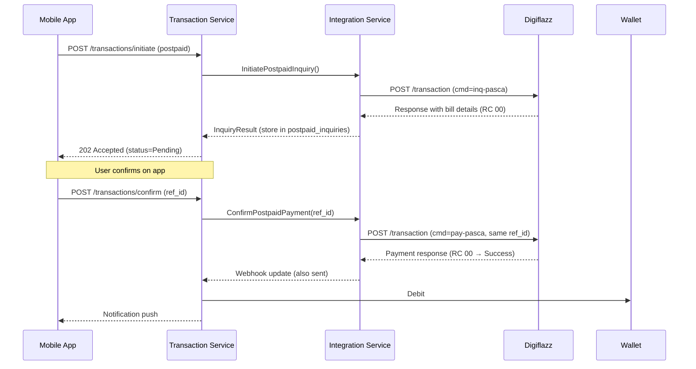

# 🔌 Digiflazz Integration Guide

**Audience:** Backend developers, integration engineers  
**Last Updated:** 2026-05-07  
**Status:** Draft — requires sandbox testing before production

---

## 1. Overview

This guide provides implementation-level details for all interactions with Digiflazz API, covering authentication, product synchronization, transaction initiation, webhook handling, error mapping, retry policies, and monitoring.

**Base URL:** `https://api.digiflazz.com/v1`

**Sandbox:** Available upon request from Digiflazz support. Use `testing: true` in all sandbox requests.

---

## 2. Authentication

### 2.1 Signature Generation

Digiflazz uses HMAC-style signature for each request.

**Formula:** `sign = md5(username + apiKey + cmd)` for most endpoints.

**Example (price-list):**
```go
func generateSignature(username, apiKey, cmd string) string {
    data := username + apiKey + cmd
    hash := md5.Sum([]byte(data))
    return hex.EncodeToString(hash[:])
}
```

**Important:** `cmd` varies per endpoint:
- Cek Saldo: `cmd = "deposit"`
- Price List: `cmd = "pricelist"`
- Transaction (prepaid): `cmd = ref_id` (the unique ref_id you generate)
- Transaction (postpaid inquiry): `cmd = "inq-pasca"` + `ref_id`
- Transaction (postpaid payment): `cmd = "pay-pasca"` + `ref_id`
- Cek Status Pascabayar: `cmd = "status-pasca"` + `ref_id`

**Note:** Some commands concatenate ref_id differently; double-check Digiflazz official docs.

### 2.2 Credential Storage

Store `username` and `apiKey` in HashiCorp Vault:
- Path: `secret/digiflazz/credentials`
- Data: `{ "username": "your_username", "api_key": "your_api_key" }`

**Fetch at service startup (Integration Service):**
```go
secret, err := vault.KVv2(ctx).Get("secret/data/digiflazz/credentials")
if err != nil {
    log.Fatal("failed to fetch Digiflazz credentials")
}
username := secret.Data["username"].(string)
apiKey := secret.Data["api_key"].(string)
```

**Rotation:** Quarterly or if compromise suspected. After rotation, update Vault and restart Integration Service (graceful reload preferred).

---

## 3. Product Synchronization

### 3.1 Sync Schedule

| Product Type | Frequency | Cron Expression | Notes |
|---|---|---|---|
| Prepaid | Hourly | `5 * * * *` (minute 5 of every hour) | Avoids top of hour load |
| Postpaid | Every 5 minutes | `*/5 * * * *` | More frequent due to bill cycles |

**Implementation:** Kubernetes `CronJob` resource that triggers Integration Service endpoint `/internal/sync/products?type=prepaid|pasca`.

### 3.2 Sync Process

```go
func SyncProducts(productType string) error {
    // 1. Acquire distributed lock (Redlock) to prevent overlapping runs
    lock, err := redlock.Lock(ctx, "product-sync-"+productType, 4*time.Minute)
    if err != nil {
        return fmt.Errorf("could not acquire lock: %w", err)
    }
    defer redlock.Unlock(ctx, lock)

    // 2. Build request
    cmd := "prepaid"
    if productType == "pasca" {
        cmd = "pasca"
    }
    signature := generateSignature(username, apiKey, cmd)

    // 3. Call Digiflazz price-list
    resp, err := http.PostForm(digiflazzBaseURL+"/price-list", url.Values{
        "cmd":      {cmd},
        "username": {username},
        "sign":     {signature},
    })
    if err != nil {
        return err
    }
    defer resp.Body.Close()

    // 4. Parse response
    var payload struct {
        Data []Product `json:"data"`
    }
    if err := json.NewDecoder(resp.Body).Decode(&payload); err != nil {
        return err
    }

    // 5. Upsert each product into DB within transaction (bulk)
    return db.Transaction(func(tx *gorm.DB) error {
        for _, p := range payload.Data {
            // Upsert: insert if new, update if changed
            var existing models.Product
            err := tx.Where("buyer_sku_code = ?", p.BuyerSKUCode).First(&existing).Error
            if errors.Is(err, gorm.ErrRecordNotFound) {
                // Create new
                product := models.Product{
                    ProductID:        uuid.New(),
                    BuyerSKUCode:     p.BuyerSKUCode,
                    ProductName:      p.ProductName,
                    Category:         p.Category,
                    Brand:            p.Brand,
                    BasePrice:        p.Price,
                    PlatformMarkup:   config.PlatformMarkupPercent, // from config, e.g., 0.05 (5%)
                    PlatformPrice:    p.Price * (1 + config.PlatformMarkupPercent),
                    IsPrepaid:        productType == "prepaid",
                    LastSyncAt:       time.Now(),
                }
                if err := tx.Create(&product).Error; err != nil {
                    return err
                }
            } else if err == nil {
                // Update if price changed
                if existing.BasePrice != p.Price {
                    existing.BasePrice = p.Price
                    existing.PlatformPrice = p.Price * (1 + config.PlatformMarkupPercent)
                    existing.LastSyncAt = time.Now()
                    if err := tx.Save(&existing).Error; err != nil {
                        return err
                    }
                }
            } else {
                return err
            }
        }
        return nil
    })
}
```

### 3.3 Rate Limit Handling

**Digiflazz Limit:** 1 price-list query per 5 minutes (RC 83 if exceeded).

**Our Strategy:**
- Prepaid: run hourly (minute 5) — well within limit
- Postpaid: run every 5 minutes (cron `*/5 * * * *`) — aligns with limit exactly
- If RC 83 received: log warning, skip this run, wait for next scheduled

**Avoid Overlap:** Redlock ensures only one pod runs sync; if lock not acquired, skip this run (already running elsewhere).

### 3.4 Delta Sync (Future Optimization)

Currently full refresh. For large catalog (10k+ products), consider:
- Store `last_sync_version` if Digiflazz provides incremental API (they do not currently)
- Use `updated_at` timestamp to only fetch changed products (if Digiflazz supports filter)
- Currently acceptable to full refresh every 5min for postpaid (few hundred products max)

---

## 4. Transaction Initiation

### 4.1 Prepaid (Synchronous)

**Endpoint:** `POST https://api.digiflazz.com/v1/transaction`

**Parameters:**
```json
{
  "username": "your_username",
  "buyer_sku_code": "xld25",
  "customer_no": "087800001233",
  "ref_id": "unique_ref_id_123456",
  "sign": "md5(username+apiKey+ref_id)",
  "testing": false  // set true for sandbox
}
```

**Flow in Integration Service:**

```go
func (s *Service) InitiateTransaction(ctx context.Context, req InitiateRequest) (TransactionResponse, error) {
    // 1. Validate: user exists, product active, wallet has sufficient balance
    user, err := s.userService.GetUser(ctx, req.UserID)
    if err != nil {
        return TransactionResponse{}, err
    }

    // 2. Check wallet (with hold)
    wallet, err := s.walletService.GetActiveWallet(ctx, user.ID)
    if err != nil {
        return TransactionResponse{}, err
    }
    if wallet.BalanceAvailable < req.SellingPrice {
        return TransactionResponse{}, ErrInsufficientBalance
    }

    // 3. Generate ref_id (UUIDv7 recommended for time-ordering)
    refID := uuid.New().String()  // or uuidv7.Generate()

    // 4. Reserve amount (hold)
    err = s.walletService.PlaceHold(ctx, wallet.WalletID, req.SellingPrice, refID)
    if err != nil {
        return TransactionResponse{}, err
    }

    // 5. Build Digiflazz request
    signature := generateSignature(username, apiKey, refID)
    digiflazzReq := map[string]string{
        "username":        username,
        "buyer_sku_code":  req.ProductSKU,
        "customer_no":     req.CustomerNo,
        "ref_id":          refID,
        "sign":            signature,
        "testing":         strconv.FormatBool(s.config.TestingMode),
    }

    // 6. Call Digiflazz with timeout and retry
    var resp DigiflazzTransactionResponse
    err = withRetry(func() error {
        resp, err = s.httpClient.PostForm(digiflazzURL, digiflazzReq)
        return err
    }, 3, 2*time.Second)  // max 3 attempts, 2s backoff

    if err != nil {
        // Release hold since we never got response
        s.walletService.ReleaseHold(ctx, refID)
        return TransactionResponse{}, ErrDigiflazzUnavailable
    }

    // 7. Parse response
    internalStatus := mapRCtoStatus(resp.Data.RC)

    // 8. Create transaction record (Initiated or Pending or Success)
    tx := models.Transaction{
        TransactionID: uuid.New(),
        RefID:         refID,
        WalletID:      wallet.WalletID,
        UserID:        user.ID,
        ProductID:     req.ProductID,
        CustomerNo:    req.CustomerNo,
        Amount:        resp.Data.Price,           // from Digiflazz (platform cost)
        SellingPrice:  req.SellingPrice,          // what we charged user
        Status:        internalStatus,
        DigiflazzResponse: resp.Data,
        CreatedAt:     time.Now(),
    }
    if err := s.db.Create(&tx).Error; err != nil {
        s.walletService.ReleaseHold(ctx, refID)  // compensation
        return TransactionResponse{}, err
    }

    // 9. If RC=00 (immediate success), release hold and debit for real
    if internalStatus == models.TransactionSuccess {
        s.walletService.ReleaseHoldAndDebit(ctx, refID)  // converts hold → actual debit
    }
    // If RC=03 (Pending), hold remains until webhook confirms success/failure
    // If RC=other (Failed), release hold immediately

    return TransactionResponse{
        TransactionID: tx.TransactionID,
        RefID:         refID,
        Status:        internalStatus,
        Message:       resp.Data.Message,
    }, nil
}
```

### 4.2 Postpaid (Two-Step: Inquiry + Pay)

**Step 1 — Inquiry:**
```json
{
  "commands": "inq-pasca",
  "username": "...",
  "buyer_sku_code": "pln",
  "customer_no": "530000000003",
  "ref_id": "unique_ref_id_123456",
  "sign": "md5(username + apiKey + ref_id)"
}
```

**Response includes:** `customer_name`, `periode`, `detail[].nilai_tagihan`, `admin`, `price`, `selling_price`.

**Step 2 — Pay (same `ref_id`):**
```json
{
  "commands": "pay-pasca",
  "username": "...",
  "buyer_sku_code": "pln",
  "customer_no": "530000000003",
  "ref_id": "same_as_inquiry",
  "sign": "md5(username + apiKey + ref_id)"
}
```

**Important:** Inquiry and Pay share the same `ref_id`. Store inquiry result in `postpaid_inquiries` table with 24h TTL.

**`postpaid_inquiries` Table:**
```sql
CREATE TABLE postpaid_inquiries (
    inquiry_id UUID PRIMARY KEY,
    ref_id VARCHAR(255) UNIQUE NOT NULL,
    product_id UUID NOT NULL,
    customer_no VARCHAR(255) NOT NULL,
    customer_name TEXT,
    bill_details JSONB NOT NULL,  -- full Digiflazz response `desc`
    admin_amount DECIMAL(18,2),
    total_amount DECIMAL(18,2),
    selling_price DECIMAL(18,2),
    expires_at TIMESTAMP NOT NULL,  -- 24h from inquiry
    created_at TIMESTAMP DEFAULT CURRENT_TIMESTAMP,
    FOREIGN KEY (product_id) REFERENCES products(product_id)
);
CREATE INDEX idx_postpaid_inquiry_ref ON postpaid_inquiries(ref_id);
CREATE INDEX idx_postpaid_inquiry_expires ON postpaid_inquiries(expires_at);
```

---

## 5. Webhook Handling

### 5.1 Webhook Endpoint

**URL:** `POST /integration/digiflazz/webhook`  
**Headers:**
- `X-Digiflazz-Event`: `create` or `update`
- `User-Agent`: `Digiflazz-Hookshot` (prepaid) or `Digiflazz-Pasca-Hookshot` (postpaid)
- `X-Hub-Signature`: `sha1=<hmac_sha1_of_raw_body>`

### 5.2 Signature Verification

```go
func verifyWebhookSignature(payload []byte, signatureHeader, secret string) bool {
    // signatureHeader format: "sha1=7d6f016c23d03b696e76dada91c07f178cc0af4d"
    expected := hmac.New(sha1.New, []byte(secret))
    expected.Write(payload)
    expectedHex := hex.EncodeToString(expected.Sum(nil))

    received := strings.TrimPrefix(signatureHeader, "sha1=")
    return hmac.Equal([]byte(expectedHex), []byte(received))
}
```

**Secret:** Fetch from Vault at `secret/digiflazz/webhook_secret` (different from API key).

### 5.3 Idempotent Processing

```go
func handleWebhook(w http.ResponseWriter, r *http.Request) {
    // 1. Read raw body (need for signature verification)
    body, err := io.ReadAll(r.Body)
    if err != nil {
        http.Error(w, "cannot read body", http.StatusBadRequest)
        return
    }

    // 2. Verify signature
    signature := r.Header.Get("X-Hub-Signature")
    secret := vault.Get("secret/digiflazz/webhook_secret")
    if !verifyWebhookSignature(body, signature, secret) {
        log.Warn("invalid webhook signature")
        http.Error(w, "unauthorized", http.StatusUnauthorized)
        return
    }

    // 3. Parse payload
    var payload WebhookPayload
    if err := json.Unmarshal(body, &payload); err != nil {
        http.Error(w, "invalid json", http.StatusBadRequest)
        return
    }

    // 4. Extract ref_id
    refID := payload.Data.RefID
    if refID == "" {
        http.Error(w, "missing ref_id", http.StatusBadRequest)
        return
    }

    // 5. Acquire lock on this transaction (prevent concurrent webhook processing)
    lockKey := fmt.Sprintf("webhook:txn:%s", refID)
    acquired, err := redis.SetNX(ctx, lockKey, "1", 30*time.Second).Result()
    if err != nil || !acquired {
        // Another webhook for same transaction already processing; return 200 to stop retry
        w.WriteHeader(http.StatusOK)
        return
    }
    defer redis.Del(ctx, lockKey)

    // 6. Process asynchronously (queue) — respond 200 immediately to Digiflazz
    go webhookProcessor.Process(r.Context(), payload)

    w.WriteHeader(http.StatusOK)
    json.NewEncoder(w).Encode(map[string]string{"message": "received"})
}
```

### 5.4 Event Types

| X-Digiflazz-Event | When Sent | Action |
|---|---|---|
| `create` | Transaction initially created (RC 03 or 00) | Usually redundant (we already have response from initiation call); can ignore or set initial status |
| `update` | Status changes (Pending→Success, Pending→Failed) | **Primary trigger** for state transition |

### 5.5 Ping Events

Digiflazz sends ping to verify webhook endpoint is alive.

**Payload:**
```json
{
  "sed": "random-string-abc123",
  "hook_id": "11aaabbb",
  "hook": {
    "url": "https://our-api/webhook",
    "type": "application/json",
    "status": 1
  }
}
```

**Response:** Must return `200 OK` with same `sed` in body:
```json
{
  "sed": "random-string-abc123"
}
```

**Implementation:** Separate endpoint `/integration/digiflazz/ping` or same webhook endpoint that detects ping by absence of `data` field.

---

## 6. Error Mapping & Retry

### 6.1 Full RC → Internal Mapping

See `ERROR_HANDLING.md` for full table. Key mappings:

| RC | Internal Status | Retry? | User Message ( Indonesian ) | Backoff |
|---|---|---|---|---|
| 00 | Success | No | "Transaksi berhasil" | — |
| 01 | Initiated → retry | Yes (max 3) | "Timeout, mencoba ulang..." | 2s, 4s, 8s |
| 03 | Pending | No (wait webhook) | "Transaksi sedang diproses" | Poll after 10min if no webhook |
| 40–42 | Failed | No | "Format request salah" | — |
| 43–55 | Failed | No (product/nummer issue) | "Produk tidak tersedia" / "Nomor salah" | — |
| 56–59 | Failed | No | "Sistem sedang gangguan" | — |
| 60–63 | Failed | No | "Tagihan belum tersedia" | — |
| 68 | Failed | No | "Stok habis" | — |
| 70 | Initiated → retry | Yes (max 3) | "Timeout dari biller" | 2s, 4s, 8s |
| 71 | Initiated → retry | Yes (max 2) | "Produk tidak stabil" | 5s, 10s |
| 83 | Failed (on sync) | Yes (after 4min wait) | "Limit API, coba 4 menit" | Wait 240s |
| 85 | Failed (rate limit) | Yes (once) | "Rate limit, coba 1 menit" | Wait 60s |
| 99 | Pending | Yes (max 3) | "Router error" | 5s, 10s, 20s |

### 6.2 Retry Implementation

```go
func withRetry(operation func() error, maxAttempts int, initialDelay time.Duration) error {
    var lastErr error
    delay := initialDelay

    for attempt := 1; attempt <= maxAttempts; attempt++ {
        lastErr = operation()
        if lastErr == nil {
            return nil
        }

        // Check if retryable
        if !isRetryable(lastErr) {
            return lastErr
        }

        if attempt < maxAttempts {
            time.Sleep(delay)
            delay *= 2  // exponential backoff
        }
    }
    return lastErr
}

func isRetryable(err error) bool {
    // Check if error corresponds to RC 01, 70, 71, 99, or network timeout
    var digiErr DigiflazzError
    if errors.As(err, &digiErr) {
        return digiErr.RC == "01" || digiErr.RC == "70" || digiErr.RC == "71" || digiErr.RC == "99"
    }
    // Network errors also retryable
    if errors.Is(err, context.DeadlineExceeded) || errors.Is(err, os.ErrDeadlineExceeded) {
        return true
    }
    return false
}
```

---

## 7. Webhook Verification Implementation

### 7.1 HMAC Secret Rotation

**Rotation Process (Manual):**
1. Generate new random 32-byte secret
2. Store in Vault at `secret/digiflazz/webhook_secret` (overwrite)
3. Update Digiflazz dashboard with new secret (coordinate with them; downtime ~1min)
4. Deploy our updated config (hot-reload Vault) — new secret fetched automatically within 1 minute
5. Keep old secret in Vault for 7 days as fallback (try both during verification)

**Dual-secret verification:**
```go
func verifyWithFallback(payload []byte, signature string) bool {
    secrets := []string{currentSecret, previousSecret}  // from Vault
    for _, secret := range secrets {
        if verifyHMAC(payload, signature, secret) {
            return true
        }
    }
    return false
}
```

---

## 8. Monitoring & Alerting

### 8.1 Key Metrics to Expose

**Integration Service Metrics:**
- `digiflazz_api_calls_total{endpoint, status}` — counter
- `digiflazz_api_duration_seconds{endpoint}` — histogram
- `webhook_received_total{event_type}` — counter
- `webhook_processing_errors_total` — counter
- `product_sync_last_success_timestamp` — gauge (Unix epoch)
- `product_sync_duration_seconds` — histogram

### 8.2 Alert Thresholds

| Alert | Condition | Severity | Runbook |
|---|---|---|---|
| `DigiflazzAPIErrorRateHigh` | error rate > 10% over 5min | critical | Check Digiflazz status, circuit breaker state |
| `WebhookProcessingBacklog` | pending webhooks queue > 100 | warning | Check consumer lag, restart worker pods |
| `ProductSyncFailed` | last_success > 2 hours (prepaid) | warning | Manual trigger, check logs for RC 83 |
| `PendingTransactionsStuck` | pending count > 100 | warning | Check webhook receiver, Digiflazz connectivity |

---

## 9. Circuit Breaker Pattern

**Library:** `github.com/sony/gobreaker` or `afex/hystrix-go`

**Configuration:**
```go
var cb = gobreaker.NewCircuitBreaker(gobreaker.Settings{
    Name:        "DigiflazzAPI",
    MaxRequests: 5,           // allow up to 5 requests to pass through when open
    Interval:    1 * time.Minute,
    Timeout:     10 * time.Second, // stay open for 10s before half-open
    ReadyToTrip: func(counts gobreaker.Counts) bool {
        // Trip if >50% errors in last 20 requests
        return counts.ConsecutiveFailures > 10 || counts.TotalFailures > counts.TotalRequests*0.5
    },
})
```

**Usage:**
```go
resp, err := cb.Execute(func() (interface{}, error) {
    return http.PostForm(url, data)
})
if err != nil {
    if cb.State() == gobreaker.StateOpen {
        // Short-circuit immediately without call
        return ErrDigiflazzCircuitOpen
    }
    // Retry logic...
}
```

**State:** Closed (normal) → Open (too many failures) → Half-Open (test) → Closed.

---

## 10. Idempotency Implementation

**Client-side (Mobile):**
- Generate `Idempotency-Key: UUIDv4` per transaction initiation attempt
- Store locally; if user retries same transaction, reuse same key
- Server stores mapping: `(key_hash, user_id, action='initiate', resource_id=transaction_id, expires_at=24h)`

**Server-side:**
```go
func InitiateTransaction(ctx context.Context, req InitiateRequest) error {
    idemKey := req.IdempotencyKey  // from header
    keyHash := sha256.Sum256([]byte(idemKey))

    // Check if key exists
    var existing models.IdempotencyKey
    err := db.Where("key_hash = ? AND expires_at > NOW()", keyHash).First(&existing).Error
    if err == nil {
        // Duplicate request — return existing transaction ID (no new transaction)
        return DuplicateRequestError{TransactionID: existing.ResourceID}
    } else if !errors.Is(err, gorm.ErrRecordNotFound) {
        return err
    }

    // Create idempotency record FIRST (within same transaction as transaction creation)
    return db.Transaction(func(tx *gorm.DB) error {
        idem := models.IdempotencyKey{
            KeyHash:     hex.EncodeToString(keyHash[:]),
            UserID:      req.UserID,
            Action:      "transaction_initiate",
            ResourceID:  nil,  // will set after transaction created
            ExpiresAt:   time.Now().Add(24 * time.Hour),
        }
        if err := tx.Create(&idem).Error; err != nil {
            return err
        }

        // Create transaction
        txn := models.Transaction{...}
        if err := tx.Create(&txn).Error; err != nil {
            return err
        }

        // Update idempotency key with transaction ID
        idem.ResourceID = txn.TransactionID
        return tx.Save(&idem).Error
    })
}
```

---

## 11. Product Sync Error Handling

### 11.1 Digiflazz RC 83 Handling (Pricelist Limit)

**Scenario:** We exceed 1 query per 5min limit.

**Response:** RC 83 with message "Limitasi pengecekan pricelist tercapai"

**Action:**
1. Log warning with timestamp
2. Do NOT retry immediately — wait 4 minutes (just under limit window)
3. If still RC 83 after wait, skip this sync run (next run in 1 hour for prepaid)
4. Alert finance/admin if RC 83 occurs persistently (>3 times/day) — may indicate multiple sync pods running (bug)

### 11.2 Partial Sync Failure

If one product fails to upsert (DB constraint violation), rollback entire batch. Log error with product SKU. Full sync is atomic.

### 11.3 Sync Drift Detection

If `platform_price` in our DB differs from Digiflazz `price` + markup by >5%, log warning and alert product manager (potential pricing issue).

---

## 12. Timeout Configuration

| Operation | Timeout | Rationale |
|---|---|---|
| Digiflazz transaction request | 30s | Prepaid max 30s; postpaid longer but we use async webhook so 30s is enough for initial response |
| Price-list sync | 60s | Catalog size ~1k products; should complete faster |
| Cek Saldo (balance check) | 10s | Quick endpoint |
| Webhook processing | 5s (HTTP response) | Digiflazz expects quick ACK; long processing should be async |
| DB transaction (wallet debit) | 5s | Prevent deadlock wait buildup |

**HTTP Client:**
```go
client := &http.Client{
    Timeout: 30 * time.Second,
    Transport: &http.Transport{
        MaxIdleConns:        10,
        MaxConnsPerHost:     5,
        IdleConnTimeout:     90 * time.Second,
        TLSHandshakeTimeout: 10 * time.Second,
    },
}
```

---

## 13. Testing Strategy

### 13.1 Unit Tests
- Signature generation with known inputs
- RC mapping table (every code)
- Hold/release calculations

### 13.2 Integration Tests (Sandbox)
- Full sync against Digiflazz sandbox (prepaid & postpaid)
- Transaction initiation with sandbox (use `testing=true`)
- Webhook delivery simulation (send sample webhook payload to local tunnel)

### 13.3 End-to-End Tests (Staging)
- Deploy to staging (with real Digiflazz credentials in sandbox mode)
- Execute full flow: sync → login → initiate → wait webhook → verify balance
- Test error scenarios: RC 68 (out of stock), RC 85 (rate limit), network timeout

---

## 14. Configuration Reference

**Environment Variables for Integration Service:**

| Variable | Description | Default |
|---|---|---|
| `DIGIFLAZZ_BASE_URL` | API base URL | `https://api.digiflazz.com/v1` |
| `DIGIFLAZZ_USERNAME` | Vault path for username | `secret/digiflazz/username` |
| `DIGIFLAZZ_API_KEY` | Vault path for API key | `secret/digiflazz/api_key` |
| `DIGIFLAZZ_WEBHOOK_SECRET` | Vault path for webhook HMAC secret | `secret/digiflazz/webhook_secret` |
| `PLATFORM_MARKUP_PERCENT` | Platform markup as decimal (0.05 = 5%) | `0.05` |
| `TESTING_MODE` | Set `true` to add `testing=true` to all requests | `false` |
| `REDIS_ADDR` | Redis for locks and idempotency | `redis:6379` |
| `MAX_RETRY_ATTEMPTS` | Max retries for Digiflazz calls | `3` |
| `RETRY_BASE_DELAY_MS` | Initial backoff in ms | `2000` |

---

## 15. Common Pitfalls & Troubleshooting

| Symptom | Likely Cause | Solution |
|---|---|---|
| RC 83 (pricelist limit) | Multiple sync pods running | Ensure Redlock working; check pod count |
| Webhooks not arriving | Digiflazz webhook URL misconfigured | Verify public URL reachable, `/health/ready` passes |
| Webhook 401 | Signature secret mismatch | Sync secret between Digiflazz dashboard and our Vault |
| Transactions stuck in Pending | Our webhook endpoint down or slow | Ensure 200 OK quickly; process async |
| Duplicate transactions | Idempotency not enforced | Check `idempotency_keys` table unique constraint |
| Wallet negative balance | Race condition on hold release | Verify `SELECT FOR UPDATE` on wallet row during hold operations |
| Slow sync (minutes) | No index on `buyer_sku_code` | Add index: `CREATE INDEX idx_products_sku ON products(buyer_sku_code);` |

---

## Appendix A — Full Request/Response Examples

See `v1/docs/digiflazz/DIGIFLAZZ_DOC.md` for complete API spec.

---

## Appendix B — Webhook Retry Behavior (Digiflazz Side)

Digiflazz retries webhook delivery for **72 hours** with exponential backoff:
- First retry: ~1 minute after initial
- Subsequent: doubling interval up to 1 hour

**Our responsibility:** Return 2xx within 5 seconds to stop retries. If we return 5xx or timeout, Digiflazz continues retrying.

---

## Appendix C — Postpaid Two-Step Transaction Flow



**Important:** Both inquiry and pay use same `ref_id`. Store inquiry result; pay must occur within 24h or inquiry expires.

---

## Appendix D — Error Code Quick Reference

Print this table and post near developer desk:

| RC | Meaning | Action |
|---|---|---|
| 00 | Success | — |
| 03 | Pending | Wait webhook |
| 01,70 | Timeout | Retry (3x) |
| 44 | Platform balance insufficient | ALERT ADMIN — top up Digiflazz deposit |
| 68 | Out of stock | Show "Stok habis" |
| 85 | Rate limit | Wait 60s, retry once |
| 83 | Pricelist limit hit | Wait 4min |
| 99 | Router issue | Retry |

---

## Next Steps

1. Implement signature generator unit tests
2. Build product sync cron job with Redlock
3. Create webhook endpoint with HMAC verification
4. Implement idempotency middleware
5. Deploy to sandbox, run full integration tests
6. Document all error cases observed in sandbox
7. Prepare for production credentials (request from Digiflazz)

---

**Owner:** Integration Team  
**Related Docs:** `ERROR_HANDLING.md`, `TRANSACTION_STATE_MACHINE.md`, `SECURITY_ARCHITECTURE.md`
