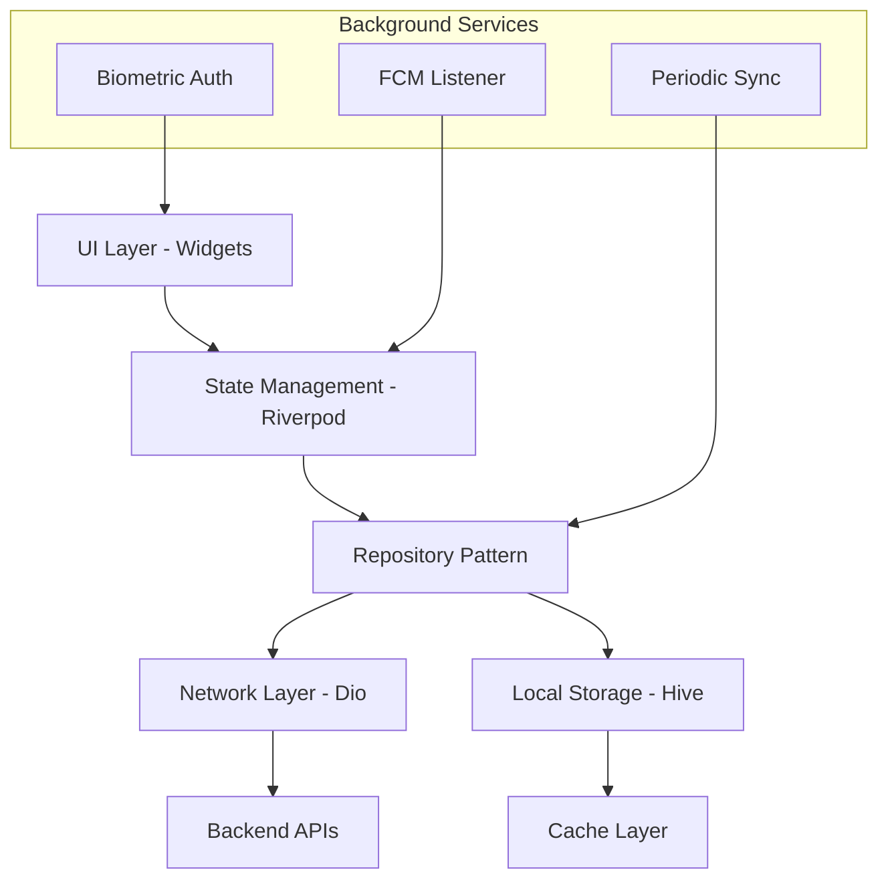

# 📱 Mobile Application Specification for PPOB (Flutter)

**Audience:** Flutter developers, mobile UI/UX designers  
**Last Updated:** 2026-05-07  
**Status:** Draft — UI component library to be built

---

## 1. Overview

This document specifies requirements, architecture, and implementation details for the PPOB mobile application built with Flutter. It covers state management, offline strategy, push notifications, biometrics, local storage, performance budgets, and network layer.

**Target Platforms:** Android 8.0+ (API 26+), iOS 13.0+

---

## 2. Architecture Overview



**Separation of Concerns:**
- **UI Layer:** Stateless widgets, consume providers
- **State Management:** Riverpod `StateNotifier` or `Bloc` (choose one; Riverpod recommended)
- **Repository:** Single source of truth — decides whether to fetch from network or cache
- **Network:** Dio client with interceptors (auth, retry, logging)
- **Local:** Hive NoSQL for offline data (transactions, products, user profile)

---

## 3. State Management: Riverpod

**Why Riverpod?** Compile-safe, no `BuildContext` dependency for providers, excellent testing, supports `StateNotifier` for complex state.

**Provider Structure:**

```
providers/
  auth/
    auth_provider.dart        -- current user + token
    device_fingerprint_provider.dart
  wallet/
    wallet_provider.dart       -- balance, holds
    transaction_history_provider.dart
  product/
    product_catalog_provider.dart
    category_provider.dart
  transaction/
    transaction_init_provider.dart  -- state machine for current txn
  settings/
    settings_provider.dart     -- app config, biographic enabled
```

**Example: Wallet Provider**

```dart
final walletProvider = StateNotifierProvider<WalletNotifier, WalletState>((ref) {
  return WalletNotifier(ref.watch(walletRepositoryProvider));
});

class WalletState {
  final Decimal availableBalance;
  final Decimal heldBalance;
  final WalletStatus status;  // loading, loaded, error
  final String? errorMessage;
  
  const WalletState({...});
}

class WalletNotifier extends StateNotifier<WalletState> {
  final WalletRepository _repo;
  
  WalletNotifier(this._repo) : super(const WalletState.initial()) {
    loadWallet();
  }
  
  Future<void> loadWallet() async {
    state = const WalletState.loading();
    try {
      final wallet = await _repo.getActiveWallet();
      state = WalletState.loaded(available: wallet.available, held: wallet.held);
    } catch (e) {
      state = WalletState.error(message: e.message);
    }
  }
  
  Future<void> initiateTransaction(TransactionRequest req) async {
    state = const WalletState.transactionProcessing();
    try {
      final tx = await _repo.initiateTransaction(req);
      state = WalletState.transactionSubmitted(txId: tx.id);
    } on InsufficientBalanceException {
      state = WalletState.error(message: "Saldo tidak mencukupi");
    } catch (e) {
      state = WalletState.error(message: "Transaksi gagal: ${e.message}");
    }
  }
}
```

---

## 4. Offline-First Strategy

### 4.1 Local Database: Hive

**Why Hive?** No native platform bridge (unlike SQLite), fast, simple API, supports encryption.

**Boxes (Collections):**
- `user_box` — user profile, tokens (encrypted)
- `wallet_box` — wallet balance snapshot
- `transactions_box` — transaction history (query by date)
- `products_box` — product catalog cache
- `pending_sync_queue` — actions waiting for network

**Hive Setup:**

```dart
await Hive.initFlutter();
final encryptionKey = await _getOrCreateEncryptionKey(); // derived from user PIN? Or server-issued
Hive.registerAdapter(TransactionAdapter());
Hive.registerAdapter(ProductAdapter());

final productsBox = await Hive.openBox<Product>('products', encryptionCipher: HiveAesCipher(encryptionKey));
```

**Encryption Key Derivation:**
- On first login, server returns `local_encryption_key` (encrypted with user's PIN-derived key)
- Client derives key from PIN using PBKDF2 (matching server's argon2id? No, can't match exactly).
- **Simpler:** Server generates random 256-bit key, encrypts with user's PIN hash (not ideal). **Better:** Use device-specific keystore (Android Keystore / iOS Keychain) to store master key; not tied to PIN.
- **Decision:** Device Keystore stores master key; Hive encrypted with that. User PIN only authorizes app unlock, not decryption key.

### 4.2 Write Queue for Offline Transactions

If user initiates transaction with no internet:
1. Store transaction request in `pending_sync_queue` box as `PendingSyncItem`
2. Mark local UI as "Pending sync" with spinner
3. Background connectivity listener detects internet
4. For each pending item, retry with exponential backoff (max 5 attempts)
5. On success, remove from queue, update local state
6. On permanent failure (after retries), mark as `Failed` and notify user

**PendingSyncItem schema:**
```dart
class PendingSyncItem {
  final String id; // uuid
  final String type; // 'transaction_initiate'
  final Map<String, dynamic> payload;
  final int retryCount;
  final DateTime lastAttempt;
  final SyncStatus status; // pending, retrying, failed, completed
}
```

**Sync Service (background isolate or foreground service on Android):**
```dart
class SyncService {
  void start() {
    connectivity.onConnectivityChanged.listen((result) {
      if (result != ConnectivityResult.none) {
        _processPendingQueue();
      }
    });
  }
  
  Future<void> _processPendingQueue() async {
    final box = Hive.box<PendingSyncItem>('pending_sync_queue');
    for (var item in box.values.where((i) => i.status != SyncStatus.completed)) {
      try {
        await _retryOperation(item);
        item.status = SyncStatus.completed;
        item.save();
      } catch (e) {
        item.retryCount++;
        item.lastAttempt = DateTime.now();
        if (item.retryCount >= 5) {
          item.status = SyncStatus.failed;
        }
        item.save();
      }
    }
  }
}
```

### 4.3 Read Strategy: Optimistic UI

- List screens (transactions, products) load from local Hive immediately (fast)
- Simultaneously fetch from network; on response, update local and refresh UI
- Pull-to-refresh triggers network fetch (bypass cache)

**Product Catalog Cache TTL:** 1 hour. After TTL, show cached but display "Prices may be outdated" banner; refresh on next app foreground.

---

## 5. Push Notifications (FCM)

### 5.1 Notification Channels (Android) / Categories (iOS)

| Channel | Importance | Use Cases |
|---|---|---|
| `transactions` | High | Transaction success/failure, low balance |
| `alerts` | High | Account security alerts (new device login) |
| `staff` | Default | Staff added, top-up received |
| `marketing` | Low (optional opt-out) | Promotions (not in initial scope) |

### 5.2 FCM Payload Format

**Data-only messages** (handled by app, not shown automatically):

```json
{
  "to": "<FCM_token>",
  "data": {
    "type": "transaction_success",
    "transaction_id": "a1b2c3d4",
    "amount": "27000",
    "selling_price": "30000",
    "product_name": "XL Data 25GB",
    "customer_no": "+6281234567890",
    "deep_link": "ppob://transactions/a1b2c3d4"
  },
  "priority": "high",
  "time_to_live": 3600
}
```

**Handling in Flutter:**

```dart
FirebaseMessaging.onMessage.listen((RemoteMessage message) {
  final type = message.data['type'];
  switch (type) {
    case 'transaction_success':
      final amount = double.parse(message.data['amount']);
      final product = message.data['product_name'];
      showNotification(
        title: "Transaksi Berhasil",
        body: "Rp ${amount.toStringAsFixed(0)} — $product",
        deepLink: message.data['deep_link'],
      );
      break;
    case 'low_balance_warning':
      showNotification(
        title: "Saldo Rendah",
        body: "Saldo Anda < Rp 10.000. Segera top up!",
        deepLink: "ppob://wallet",
      );
      break;
  }
});
```

**Background Handler:** Must be top-level function; route to appropriate provider.

---

## 6. Biometric Authentication

**Libraries:** `local_auth` (Flutter plugin)

**Use Cases:**
- Optional: replace PIN entry with fingerprint/face ID on trusted devices
- Must still have PIN fallback (3 failed biometrics → ask PIN)

**Implementation:**

```dart
class BiometricService {
  final LocalAuthentication auth = LocalAuthentication();
  
  Future<bool> isAvailable() async {
    return await auth.canCheckBiometrics();
  }
  
  Future<bool> authenticate() async {
    try {
      return await auth.authenticate(
        localizedReason: 'Autentikasi untuk transaksi PPOB',
        options: const AuthenticationOptions(
          biometricOnly: false,  // allow device PIN fallback
          stickyAuth: true,
        ),
      );
    } catch (e) {
      return false;
    }
  }
}
```

**Storage:** Biometric preference stored in Hive (user opt-in). Enrolled biometrics managed by OS; app only gets success/failure.

**Security:** Biometric unlocks access to stored access token (in memory) or authorizes transaction without PIN entry. **Never store PIN in biometric-protected storage alone** — still require PIN if biometric fails.

---

## 7. Local Storage (Hive) Schema

**Boxes & Types:**

| Box Name | Type | Purpose | TTL / Retention |
|---|---|---|---|
| `user` | `User` (1 row) | Profile, tokens (encrypted) | Never auto-clear |
| `wallet` | `Wallet` (1 row) | Cached balance (available, held) | Refresh on app open |
| `transactions` | `HiveList<Transaction>` | History (last 30 days) | Auto-clean >90 days |
| `products` | `HiveMap<String, Product>` keyed by `product_id` | Catalog cache | TTL 1 hour (timestamp) |
| `categories` | `HiveList<Category>` | Category grid | Refresh daily |
| `pending_sync_queue` | `HiveList<PendingSyncItem>` | Offline actions | Retry 5x then fail |
| `settings` | `HiveMap<String, dynamic>` | Biometric enabled, theme, etc | Persistent |

**TypeAdapters:** Generated by `hive_generator` package.

**Encryption:**
- Sensitive boxes (`user`) encrypted with AES-256
- Key stored in Android Keystore / iOS Keychain via `flutter_secure_storage`
- Other boxes (products, transactions) not encrypted (no PII except masked customer_no on some views)

---

## 8. Network Layer (Dio)

**Configuration:**

```dart
final dio = Dio(BaseOptions(
  baseUrl: ApiConfig.baseUrl,
  connectTimeout: 10000,
  receiveTimeout: 30000,
  headers: {
    'Content-Type': 'application/json',
    'Accept': 'application/json',
  },
));

// Auth interceptor — adds JWT to every request
dio.interceptors.add(InterceptorsWrapper(
  onRequest: (options, handler) async {
    final token = await _tokenProvider.getAccessToken();
    options.headers['Authorization'] = 'Bearer $token';
    handler.next(options);
  },
  onError: (error, handler) async {
    // 401 → try refresh token
    if (error.response?.statusCode == 401) {
      try {
        final newTokens = await _refreshToken();
        error.requestOptions.headers['Authorization'] = 'Bearer ${newTokens.access}';
        final clone = await dio.fetch(error.requestOptions);
        handler.resolve(clone);
      } catch (_) {
        handler.next(error); // refresh failed, logout user
      }
    } else {
      handler.next(error);
    }
  },
));

// Logging interceptor (debug only)
if (kDebugMode) {
  dio.interceptors.add(LogInterceptor(
    requestBody: true,
    responseBody: true,
    logPrint: (obj) => print(obj),
  ));
}

// Retry interceptor for transient errors
dio.interceptors.add(RetryInterceptor(
  dio: dio,
  logPrint: print,
  retries: 3,
  retryDelays: [2000, 4000, 8000],
  shouldRetry: (error) {
    final status = error.response?.statusCode;
    return status == 502 || status == 503 || status == 504;
  },
));
```

---

## 9. Performance Budgets

| Metric | Target | Rationale |
|---|---|---|
| **Cold Start Time** | <2s Android, <1.5s iOS | User perceives app as responsive |
| **APK Size** | <50MB (split per ABI) | Data affordability Indonesia |
| **Memory Usage** | <150MB typical, <300MB peak | Mid-range device capability |
| **Screen Render** | <16ms per frame (60fps) | No jank |
| **Initial DB Load** | <500ms | Hive open + cache read |
| **API Response** | <1s for most endpoints (not counting Digiflazz) | Good UX |

**Optimization Tactics:**
- Code splitting: `deferred loading` for rarely used screens (reports, admin)
- Lazy load transaction history (pagination, 20 per page)
- Compress images (WebP), use SVG icons
- Tree-shake unused locale data (only `id_ID` shipped)

---

## 10. Screen & Navigation Structure

**Bottom Navigation Bar:**
- Home (dashboard)
- Transactions (history)
- Wallet (balance, top-up)
- Staff (mitra only; hidden for staff)
- Profile (settings)

**Drawer Menu (Profile screen taps avatar):**
- Settings
- Change PIN
- Trusted Devices
- Help & Support
- Logout

**Named Routes (GoRouter):**
```dart
final router = GoRouter(
  routes: [
    GoRoute(path: '/', builder: (_, __) => const HomeScreen()),
    GoRoute(path: '/transactions', builder: (_, __) => const TransactionListScreen()),
    GoRoute(path: '/transactions/:id', builder: (_, state) => TransactionDetailScreen(id: state.params['id']!)),
    GoRoute(path: '/wallet', builder: (_, __) => const WalletScreen()),
    GoRoute(path: '/staff', builder: (_, __) => const StaffListScreen()),
    GoRoute(path: '/staff/add', builder: (_, __) => const AddStaffScreen()),
    GoRoute(path: '/profile', builder: (_, __) => const ProfileScreen()),
    GoRoute(path: '/login', builder: (_, __) => const LoginScreen()),
    GoRoute(path: '/register', builder: (_, __) => const RegisterScreen()),
    GoRoute(path: '/otp-verify', builder: (_, __) => const OtpVerifyScreen()),
    GoRoute(path: '/set-password-pin', builder: (_, __) => const SetPasswordPinScreen()),
    GoRoute(path: '/transaction/initiate/:productId', builder: (_, state) => InitiateTransactionScreen(productId: state.params['productId']!)),
    GoRoute(path: '/transaction/confirm', builder: (_, __) => const ConfirmTransactionScreen()),
    GoRoute(path: '/transaction/result/:txId', builder: (_, state) => TransactionResultScreen(txId: state.params['txId']!)),
  ],
);
```

---

## 11. UI Component Library

**Reusable Components:**

| Component | Variants | Props | States |
|---|---|---|---|
| `PPOBButton` | primary, secondary, text, danger | `onPressed`, `label`, `loading` | enabled, disabled, loading |
| `PPOBInput` | text, password, pin, phone | `controller`, `label`, `errorText`, `obscure` | default, focused, error, disabled |
| `PPOBCard` | elevated, outlined | `child`, `padding` | — |
| `TransactionTile` | success, pending, failed | `transaction`, `onTap` | loading skeleton |
| `ProductGridItem` | — | `product`, `onSelect` | — |
| `WalletBalanceCard` | — | `available`, `held` | — |
| `StaffListItem` | — | `staff`, `onTap`, `onTopUp` | — |

**Theming:**
```dart
final theme = ThemeData(
  primaryColor: const Color(0xFF4CAF50),
  colorScheme: ColorScheme.fromSeed(seedColor: Color(0xFF4CAF50)),
  scaffoldBackgroundColor: const Color(0xFFF5F5F5),
  appBarTheme: const AppBarTheme(
    backgroundColor: Color(0xFF4CAF50),
    foregroundColor: Colors.white,
    elevation: 0,
  ),
  elevatedButtonTheme: ElevatedButtonThemeData(
    style: ElevatedButton.styleFrom(
      padding: const EdgeInsets.symmetric(vertical: 16),
      shape: RoundedRectangleBorder(borderRadius: BorderRadius.circular(8)),
      textStyle: const TextStyle(fontSize: 16, fontWeight: FontWeight.w600),
    ),
  ),
  inputDecorationTheme: InputDecorationTheme(
    filled: true,
    fillColor: Colors.white,
    border: OutlineInputBorder(borderRadius: BorderRadius.circular(8)),
    contentPadding: const EdgeInsets.symmetric(horizontal: 16, vertical: 12),
  ),
);
```

---

## 12. Key Screen Wireframes (Text Description)

### 12.1 Home Screen
- **Header:** Greeting "Halo, {name}" + notification bell icon (red dot if unseen)
- **Balance Card:** Large font "Rp 1,250,000" + "Rp 500,000 (dikunci)" secondary text; "Top Up" button (Mitra only)
- **Quick Actions Grid:** 4×2 grid of large icons:
  - Pulsa (green)
  - Paket Data (blue)
  - PLN (orange)
  - PDAM (cyan)
  - E-Wallet (purple)
  - etc.
- **Recent Transactions:** Horizontal scroll list of last 3 transactions (product icon, status color, amount)
- **Staff Quick Access** (if Mitra): "Top up Staff" button or staff count widget

### 12.2 Transaction Flow

**Screen 1: Category Selection**
- Grid of category icons (same as home but full screen)
- Search bar at top

**Screen 2: Product Selection**
- Product list with: icon (operator logo), product name, platform price, Mitra selling price (editable?)
- Search & filter by brand
- Input field for customer number at bottom (sticky)

**Screen 3: Confirmation**
- Product details (name, price breakdown: platform Rp X, margin Rp Y)
- Customer number (masked except last 4)
- Final selling price input (editable; cannot be < platform_price)
- "Proceed" button

**Screen 4: PIN Entry**
- 6-digit PIN pad (numeric keypad UI)
- Show/hide toggle
- "Cancel" button

**Screen 5: Result**
- Success: green checkmark, "Berhasil", amount, reference number, "Selesai" button (back to home)
- Pending: yellow hourglass, "Sedang diproses", "Lihat status" button
- Failed: red cross, error reason, "Coba lagi" button

**Screen 6: Transaction History**
- Filter tabs: All, Success, Pending, Failed
- List items: date, product name, customer masked, amount, status badge
- Pull-to-refresh, infinite scroll (20 per page)
- Tap item → detail screen with full info + share button (copy results)

### 12.3 Wallet Screen
- Current balance (large)
- Held balance (pending transactions) — explain tooltip
- Transaction history (same as Transactions tab?)
- "Top Up" button (if Mitra) → shows methods? Currently only from Mitra's bank? Not in initial scope; top-up from external payment not implemented yet.

### 12.4 Staff Management (Mitra)
**Staff List:**
- Search bar
- List: name, phone, daily count/today, wallet balance, active toggle
- FAB: "+ Tambah Staff"

**Add/Edit Staff:**
- Phone number input (autocomplete from existing users if they already have account)
- Password (show strength meter)
- PIN (6-digit)
- Margin settings: radio buttons "Fixed Allowance" vs "Margin Share (%)"
  - If Fixed: input "Rp 1,000 per transaksi"
  - If Margin Share: slider 10–80% (default 60)
- Daily limits: override defaults? Number fields for transaction count and amount
- Save button

**Staff Top-Up Modal:**
- Select staff from list
- Enter amount (numeric keyboard)
- Confirm: deduct from Mitra wallet, credit staff wallet

---

## 13. Empty States & Error Screens

### 13.1 Empty States

| Screen | Empty State Illustration | CTA |
|---|---|---|
| Transactions | No clipboard icon + "Belum ada transaksi" | "Lakukan transaksi pertama" button |
| Staff (Mitra) | Empty chair icon + "Belum ada staff" | "Tambah Staff" button |
| Wallet | Wallet icon + "Saldo Rp 0" | "Top Up" button (if available) |
| No Network | Wi-Fi icon with slash + "Tidak ada koneksi" | "Coba lagi" button |

### 13.2 Error States

- **Network Error (connection failed):** Full-screen with retry button
- **Timeout:** Show spinner with "Mengambil data..." and timeout after 30s → retry
- **Server 500:** Friendly illustration + "Kami sedang memperbaiki, coba lagi nanti"
- **Insufficient Balance:** Shake animation on balance card + toast "Saldo tidak cukup"

---

## 14. Accessibility Considerations

- **Color Contrast:** All text on background meets WCAG AA (4.5:1)
- **Touch Targets:** Minimum 48×48 dp for interactive elements
- **Font Scaling:** Support system font scaling up to 200%
- **Screen Reader:** Semantic labels for icons (`Semantics` widget)
- **PIN Entry:** Large buttons for digits; spacing to prevent mis-press

---

## 15. Internationalization (i18n)

**Language:** Indonesian (id) — all UI strings in `lib/l10n/intl_id.arb`

**Number Formatting:** Indonesian locale (`IdIdom`):
- Decimal separator: comma (`,`)
- Thousand separator: dot (`.`)
- Currency: `Rp 1.000.000`

Example:
```dart
final formatter = NumberFormat.currency(locale: 'id_ID', symbol: 'Rp ');
String formatted = formatter.format(amount); // "Rp 1.250.000"
```

---

## 16. Testing Strategy

### Unit Tests (test/)
- Validate PIN regex
- Masking functions (phone, customer_no)
- Price calculation logic (platform price, margin)
- Trust score computation

### Widget Tests (test/widgets/)
- PIN input screen (6-digit pad)
- Transaction flow snapshot tests
- Empty state renders

### Integration Tests (integration_test/)
- Full happy path: login → browse → initiate → success
- Offline queue: turn off Wi-Fi, create transaction, turn on Wi-Fi, verify sync
- Biometric prompt flow (mock local_auth)

---

## 17. CI/CD for Mobile

**GitHub Actions Workflow:**

```yaml
name: Flutter CI

on:
  push:
    branches: [main, develop]
  pull_request:
    branches: [main]

jobs:
  test:
    runs-on: macos-latest  # for iOS simulator
    steps:
      - uses: actions/checkout@v3
      - uses: subosito/flutter-action@v2
      - run: flutter pub get
      - run: flutter analyze
      - run: flutter test
      - run: flutter test integration_test/

  build-apk:
    needs: test
    runs-on: ubuntu-latest
    if: github.event_name == 'push' && github.ref == 'refs/heads/main'
    steps:
      - uses: actions/checkout@v3
      - uses: subosito/flutter-action@v2
      - run: flutter build apk --release --split-per-abi
      - uses: actions/upload-artifact@v3
        with:
          name: apk
          path: build/app/outputs/apk/release/*.apk

  build-ios:
    needs: test
    runs-on: macos-latest
    # similar with flutter build ios
```

**Fastlane for Play Store / App Store:**
- `fastlane supply` for Android
- `fastlane deliver` for iOS

---

## 18. Security Considerations (Mobile)

- **Root/Jailbreak Detection:** Optional; warn user if rooted
- **Screen Capture:** Block on sensitive screens (PIN entry) using `flutter_windowmanager` (Android) or `IOS_UIScreen` (iOS)
- **KeyStore:** Store encryption keys in secure enclave, not in SharedPreferences
- **Certificate Pinning:** Optional; pin Digiflazz API certificate if MITM concern high
- **Debug Build Detection:** Disable certain features (like showing detailed error dialogs) in release builds

---

## 19. Crash Reporting & Analytics

**Crashlytics (Firebase):** Capture crashes with user ID (anonymized as `user_XXXX` to avoid PII) for correlation.

**Analytics:** Firebase Analytics events:
- `login_start`, `login_success`, `login_failure`
- `transaction_initiate`, `transaction_success`, `transaction_failed`
- `staff_added`, `wallet_topup`
- `screen_view` (auto)

**No PII in analytics:** Never send full phone number, name, or transaction IDs to Firebase (use hashed or UUID only).

---

## 20. Offline Behavior Matrix

| Feature | Offline Support | Behavior |
|---|---|---|
| Login | ❌ | Requires network; show "No internet" |
| View Dashboard | ✅ | Show cached balances (stale warning) |
| View Transaction History | ✅ | Show from Hive (time-boxed: last 30 days) |
| Browse Products | ✅ | Show cached catalog (last sync timestamp) |
| Initiate Transaction | ⚠️ | Queue for sync; show "Queued, will send when online" |
| Change PIN | ❌ | Requires network |
| Switch Role | ❌ | Requires network (fetch new wallet) |
| Receive Notifications | ✅ (FCM) | Delivered when network restored |

---

## Appendix A — Hive TypeAdapters Example

```dart
part 'transaction.g.dart';

@HiveType(typeId: 0)
class Transaction {
  @HiveField(0)
  final String id;
  
  @HiveField(1)
  final String productName;
  
  @HiveField(2)
  final double sellingPrice;
  
  @HiveField(3)
  final String status; // 'Success', 'Pending', 'Failed'
  
  @HiveField(4)
  final DateTime createdAt;
  
  // ...
}
```

Run `flutter pub run build_runner build` to generate adapters.

---

## Appendix B — Error Handling in UI

**Global Error Handler:**

```dart
class ErrorHandler {
  static void handle(BuildContext context, dynamic error) {
    if (error is AppException) {
      String message;
      switch (error.code) {
        case 'INSUFFICIENT_BALANCE':
          message = 'Saldo tidak mencukupi. Silakan top up.';
          break;
        case 'DAILY_LIMIT_EXCEEDED':
          message = 'Limit harian tercapai. Coba lagi besok.';
          break;
        default:
          message = error.message ?? 'Terjadi kesalahan';
      }
      ScaffoldMessenger.of(context).showSnackBar(SnackBar(content: Text(message)));
    } else {
      // Network or unexpected
      showDialog(
        context: context,
        builder: (_) => AlertDialog(
          title: const Text('Error'),
          content: const Text('Tidak bisa terhubung ke server'),
          actions: [TextButton(onPressed: () => Navigator.pop(context), child: const Text('OK'))],
        ),
      );
    }
  }
}
```

---

## Appendix C — Migration Plan from v1 → Event Sourced Wallet

**Phase 1:** Ship app with current wallet schema (balance column).  
**Phase 2:** Backend adds wallet_events; app still uses old endpoint for balance read.  
**Phase 3:** Backend exposes new `/wallets/{id}/balance-computed` endpoint (from events).  
**Phase 4:** App switches to new endpoint; old balance endpoint deprecated.  
**Phase 5:** Backend removes direct balance column (read-only from events).  
**Timeline:** 4 weeks, backward compatible all along.

---

## Open Questions

1. **Should we implement biometric-only login (no PIN entry)?** No — PIN still required for transaction authorization; biometric unlocks access to session.

2. **What is offline transaction queue limit?** Max 10 pending items; if full, reject new offline transactions with "Queue full, connect to internet".

3. **Should we cache transaction receipt (PDF)?** Initially no; show simple summary in app. Future: email PDF.

4. **Tablet layout?** Responsive layout; same UI scales; master-detail on large screens.

---

**Owner:** Mobile Team Lead  
**Sprint Planning:** 
- Sprint 1: Auth flow, basic screens, Hive setup
- Sprint 2: Transaction flow, offline queue
- Sprint 3: Wallet, staff management (Mitra), push notifications
- Sprint 4: Biometrics, performance tuning, polish

---

**Related:**  
- `API_CONTRACTS.md` — endpoints consumed  
- `ERROR_HANDLING.md` — error mapping for UI  
- `SECURITY_ARCHITECTURE.md` — PIN and token security
