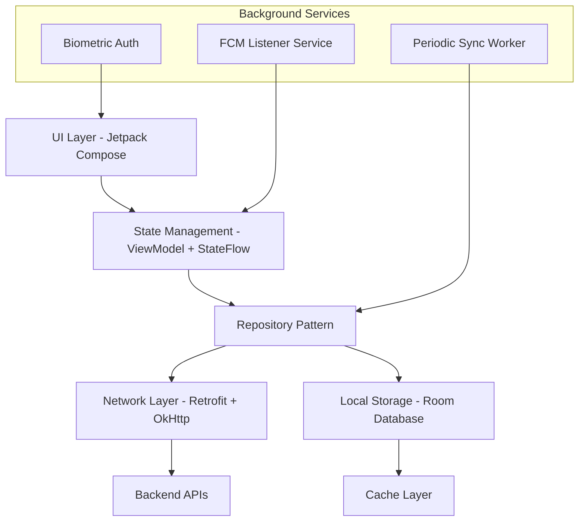

# 📱 Mobile Application Specification for PPOB (Android Native)

**Audience:** Android developers, mobile UI/UX designers  
**Last Updated:** 2026-05-09  
**Status:** Draft — UI component library to be built

---

## 1. Overview

This document specifies requirements, architecture, and implementation details for the PPOB mobile application built with Android Native (Kotlin). It covers state management, offline strategy, push notifications, biometrics, local storage, performance budgets, and network layer.

**Target Platforms:** Android 8.0+ (API 26+)

---

## 2. Architecture Overview



**Separation of Concerns:**
- **UI Layer:** Jetpack Compose screens, consume ViewModel StateFlow
- **State Management:** ViewModel + Kotlin Coroutines StateFlow (reactive, lifecycle-aware)
- **Repository:** Single source of truth — decides whether to fetch from network or cache
- **Network:** Retrofit + OkHttp client with interceptors (auth, retry, logging)
- **Local:** Room database for offline data (transactions, products, user profile)

---

## 3. State Management: ViewModel + StateFlow

**Why ViewModel + StateFlow?** Lifecycle-aware, survives configuration changes, integrates natively with Jetpack Compose, no extra dependencies.

**Provider/Module Structure (Hilt DI):**

```
di/
  modules/
    AuthModule.kt
    WalletModule.kt
    ProductModule.kt
    TransactionModule.kt
    SettingsModule.kt

viewmodels/
  auth/
    AuthViewModel.kt
    DeviceFingerprintViewModel.kt
  wallet/
    WalletViewModel.kt
    TransactionHistoryViewModel.kt
  product/
    ProductCatalogViewModel.kt
    CategoryViewModel.kt
  transaction/
    TransactionInitViewModel.kt  -- state machine for current txn
  settings/
    SettingsViewModel.kt        -- app config, biometric enabled
```

**Example: Wallet ViewModel**

```kotlin
@HiltViewModel
class WalletViewModel @Inject constructor(
    private val walletRepository: WalletRepository
) : ViewModel() {

    private val _walletState = MutableStateFlow<WalletState>(WalletState.Loading)
    val walletState: StateFlow<WalletState> = _walletState.asStateFlow()

    init {
        loadWallet()
    }

    fun loadWallet() {
        viewModelScope.launch {
            _walletState.value = WalletState.Loading
            try {
                val wallet = walletRepository.getActiveWallet()
                _walletState.value = WalletState.Loaded(
                    available = wallet.availableBalance,
                    held = wallet.heldBalance
                )
            } catch (e: Exception) {
                _walletState.value = WalletState.Error(e.message ?: "Unknown error")
            }
        }
    }

    fun initiateTransaction(request: TransactionRequest) {
        viewModelScope.launch {
            _walletState.value = WalletState.TransactionProcessing
            try {
                val tx = walletRepository.initiateTransaction(request)
                _walletState.value = WalletState.TransactionSubmitted(tx.id)
            } catch (e: InsufficientBalanceException) {
                _walletState.value = WalletState.Error("Saldo tidak mencukupi")
            } catch (e: Exception) {
                _walletState.value = WalletState.Error("Transaksi gagal: ${e.message}")
            }
        }
    }
}

sealed class WalletState {
    object Loading : WalletState()
    data class Loaded(val available: BigDecimal, val held: BigDecimal) : WalletState()
    data class Error(val message: String) : WalletState()
    object TransactionProcessing : WalletState()
    data class TransactionSubmitted(val txId: String) : WalletState()
}
```

---

## 4. Offline-First Strategy

### 4.1 Local Database: Room

**Why Room?** Native Android persistence, compile-time SQL verification, integrates with LiveData/Flow, supports encryption via SQLCipher.

**Entities (Tables):**
- `user` — user profile, tokens (encrypted)
- `wallet` — wallet balance snapshot
- `transactions` — transaction history (query by date)
- `products` — product catalog cache
- `pending_sync_queue` — actions waiting for network

**Room Setup:**

```kotlin
@Database(
    entities = [User::class, Wallet::class, Transaction::class, 
                Product::class, PendingSyncItem::class],
    version = 1,
    exportSchema = true
)
@TypeConverters(Converters::class)
abstract class PpoDatabase : RoomDatabase() {
    abstract fun userDao(): UserDao
    abstract fun walletDao(): WalletDao
    abstract fun transactionDao(): TransactionDao
    abstract fun productDao(): ProductDao
    abstract fun pendingSyncDao(): PendingSyncDao

    companion object {
        @Volatile private var INSTANCE: PpoDatabase? = null

        fun getInstance(context: Context, crypto: EncryptedSharedPreferences): PpoDatabase {
            return INSTANCE ?: synchronized(this) {
                val passphrase = SQLiteDatabase.getBytes(crypto.getString("db_key", "")!!.toCharArray())
                val factory = SupportFactory(passphrase)
                Room.databaseBuilder(
                    context.applicationContext,
                    PpoDatabase::class.java,
                    "ppob_database"
                ).openHelperFactory(factory)
                 .build()
                 .also { INSTANCE = it }
            }
        }
    }
}
```

**Encryption:** Use SQLCipher for Room to encrypt the entire database. Key derived from Android Keystore.

### 4.2 Write Queue for Offline Transactions

If user initiates transaction with no internet:
1. Store transaction request in `pending_sync_queue` table as `PendingSyncItem`
2. Mark local UI as "Pending sync" with spinner
3. Background connectivity listener detects internet via `ConnectivityManager`
4. For each pending item, retry with exponential backoff (max 5 attempts) using `WorkManager`
5. On success, remove from queue, update local state
6. On permanent failure (after retries), mark as `FAILED` and notify user

**PendingSyncItem Entity:**

```kotlin
@Entity(tableName = "pending_sync_queue")
data class PendingSyncItem(
    @PrimaryKey val id: String = UUID.randomUUID().toString(),
    val type: String,              // "transaction_initiate"
    val payload: String,           // JSON payload
    var retryCount: Int = 0,
    var lastAttempt: Long = 0L,    // epoch millis
    var status: SyncStatus = SyncStatus.PENDING
)

enum class SyncStatus { PENDING, RETRYING, FAILED, COMPLETED }
```

**Sync Worker (WorkManager):**

```kotlin
class SyncWorker(
    context: Context,
    params: WorkerParameters
) : CoroutineWorker(context, params) {

    override suspend fun doWork(): Result {
        val pendingItems = pendingSyncDao().getAllPending()
        pendingItems.forEach { item ->
            try {
                retryOperation(item)
                item.status = SyncStatus.COMPLETED
                pendingSyncDao().update(item)
            } catch (e: Exception) {
                item.retryCount++
                item.lastAttempt = System.currentTimeMillis()
                if (item.retryCount >= 5) {
                    item.status = SyncStatus.FAILED
                }
                pendingSyncDao().update(item)
            }
        }
        return Result.success()
    }
}
```

**Connectivity-triggered sync:**

```kotlin
class ConnectivityObserver(private val context: Context) {
    private val cm = context.getSystemService(Context.CONNECTIVITY_SERVICE) as ConnectivityManager

    fun observe(): Flow<Boolean> = callbackFlow {
        val callback = object : ConnectivityManager.NetworkCallback() {
            override fun onAvailable(network: Network) { trySend(true) }
            override fun onLost(network: Network) { trySend(false) }
        }
        val request = NetworkRequest.Builder().build()
        cm.registerNetworkCallback(request, callback)
        awaitClose { cm.unregisterNetworkCallback(callback) }
    }
}
```

### 4.3 Read Strategy: Optimistic UI

- List screens (transactions, products) load from local Room immediately (fast)
- Simultaneously fetch from network; on response, update local DB and refresh UI via StateFlow
- Pull-to-refresh triggers network fetch (bypass cache)

**Product Catalog Cache TTL:** 1 hour. After TTL, show cached data but display "Prices may be outdated" banner; refresh on next app foreground.

---

## 5. Push Notifications (FCM)

### 5.1 Notification Channels (Android)

| Channel | Importance | Use Cases |
|---|---|---|
| `transactions` | HIGH | Transaction success/failure, low balance |
| `alerts` | HIGH | Account security alerts (new device login) |
| `staff` | DEFAULT | Staff added, top-up received |
| `marketing` | LOW (optional opt-out) | Promotions (not in initial scope) |

### 5.2 FCM Payload Format

**Data-only messages** (handled by app, not shown automatically):

```json
{
  "to": "<FCM_token>",
  "data": {
    "type": "transaction_success",
    "transaction_id": "a1b2c3d4",
    "amount": "27000",
    "selling_price": "30000",
    "product_name": "XL Data 25GB",
    "customer_no": "+6281234567890",
    "deep_link": "ppob://transactions/a1b2c3d4"
  },
  "priority": "high",
  "time_to_live": 3600
}
```

### 5.3 Handling in Android Native

```kotlin
class FcmMessagingService : FirebaseMessagingService() {

    override fun onMessageReceived(remoteMessage: RemoteMessage) {
        val type = remoteMessage.data["type"]
        when (type) {
            "transaction_success" -> {
                val amount = remoteMessage.data["amount"]?.toDoubleOrNull() ?: 0.0
                val product = remoteMessage.data["product_name"].orEmpty()
                showNotification(
                    title = "Transaksi Berhasil",
                    body = "Rp ${amount.toInt()} — $product",
                    deepLink = remoteMessage.data["deep_link"].orEmpty()
                )
            }
            "low_balance_warning" -> {
                showNotification(
                    title = "Saldo Rendah",
                    body = "Saldo Anda < Rp 10.000. Segera top up!",
                    deepLink = "ppob://wallet"
                )
            }
        }
    }
}
```

**Notification Channel Registration (Application class):**

```kotlin
class PpoApplication : Application() {
    override fun onCreate() {
        super.onCreate()
        createNotificationChannels()
    }

    private fun createNotificationChannels() {
        val channels = listOf(
            NotificationChannel("transactions", "Transaksi", 
                NotificationManager.IMPORTANCE_HIGH),
            NotificationChannel("alerts", "Keamanan", 
                NotificationManager.IMPORTANCE_HIGH),
            NotificationChannel("staff", "Staff", 
                NotificationManager.IMPORTANCE_DEFAULT),
            NotificationChannel("marketing", "Promo", 
                NotificationManager.IMPORTANCE_LOW)
        )
        val manager = getSystemService(NotificationManager::class.java)
        channels.forEach { manager.createNotificationChannel(it) }
    }
}
```

**Deep Link Handling (AndroidManifest.xml intent-filter):**

```xml
<activity android:name=".ui.MainActivity">
    <intent-filter>
        <action android:name="android.intent.action.VIEW" />
        <category android:name="android.intent.category.DEFAULT" />
        <category android:name="android.intent.category.BROWSABLE" />
        <data android:scheme="ppob" android:host="transactions" />
    </intent-filter>
</activity>
```

---

## 6. Biometric Authentication

**API:** `BiometricPrompt` (AndroidX Biometric Library)

**Use Cases:**
- Optional: replace PIN entry with fingerprint/face ID on trusted devices
- Must still have PIN fallback (3 failed biometrics → ask PIN)

**Implementation:**

```kotlin
class BiometricService(private val context: Context) {

    private val biometricManager = BiometricManager.from(context)

    fun isAvailable(): Boolean {
        return biometricManager.canAuthenticate(
            BiometricManager.Authenticators.BIOMETRIC_STRONG or
            BiometricManager.Authenticators.DEVICE_CREDENTIAL
        ) == BiometricManager.BIOMETRIC_SUCCESS
    }

    suspend fun authenticate(reason: String = "Autentikasi untuk transaksi PPOB"): Boolean {
        return try {
            val promptInfo = BiometricPrompt.PromptInfo.Builder()
                .setTitle("Verifikasi Identitas")
                .setSubtitle(reason)
                .setNegativeButtonText("Gunakan PIN")
                .setAllowedAuthenticators(
                    BiometricManager.Authenticators.BIOMETRIC_STRONG or
                    BiometricManager.Authenticators.DEVICE_CREDENTIAL
                )
                .build()

            val biometricPrompt = BiometricPrompt(
                context as FragmentActivity,
                ContextCompat.getMainExecutor(context),
                object : BiometricPrompt.AuthenticationCallback() {
                    override fun onAuthenticationSucceeded(result: BiometricPrompt.AuthenticationResult) {
                        // Signal success via callback or sealed class
                    }
                    override fun onAuthenticationFailed() {
                        // Signal failure
                    }
                    override fun onAuthenticationError(errorCode: Int, errString: CharSequence) {
                        // Signal error
                    }
                }
            )
            biometricPrompt.authenticate(promptInfo)
            true
        } catch (e: Exception) {
            false
        }
    }
}
```

**Storage:** Biometric preference stored in `EncryptedSharedPreferences` (user opt-in). Enrolled biometrics managed by OS; app only gets success/failure.

**Security:** Biometric unlocks access to stored access token (in memory) or authorizes transaction without PIN entry. **Never store PIN in biometric-protected storage alone** — still require PIN if biometric fails.

---

## 7. Local Storage (Room) Schema

**Entities & DAOs:**

| Table | Type | Purpose | TTL / Retention |
|---|---|---|---|
| `user` | `User` (1 row) | Profile, tokens (encrypted) | Never auto-clear |
| `wallet` | `Wallet` (1 row) | Cached balance (available, held) | Refresh on app open |
| `transactions` | `Transaction` (entity) | History (last 30 days) | Auto-clean >90 days |
| `products` | `Product` (entity) | Catalog cache | TTL 1 hour (timestamp) |
| `categories` | `Category` (entity) | Category grid | Refresh daily |
| `pending_sync_queue` | `PendingSyncItem` (entity) | Offline actions | Retry 5x then fail |
| `settings` | SharedPreferences (encrypted) | Biometric enabled, theme, etc | Persistent |

**Encryption:**
- Sensitive tables (`user`) encrypted with SQLCipher (AES-256)
- Key stored in Android Keystore, never in SharedPreferences
- Other tables (products, transactions) not encrypted (no PII except masked customer_no on some views)

**DAO Example:**

```kotlin
@Dao
interface TransactionDao {
    @Query("SELECT * FROM transactions ORDER BY createdAt DESC LIMIT :limit OFFSET :offset")
    fun getTransactions(limit: Int = 20, offset: Int = 0): Flow<List<Transaction>>

    @Insert(onConflict = OnConflictStrategy.REPLACE)
    suspend fun insertAll(transactions: List<Transaction>)

    @Query("DELETE FROM transactions WHERE createdAt < :cutoff")
    suspend fun deleteOld(cutoff: Long = System.currentTimeMillis() - 90L * 86400000)
}
```

---

## 8. Network Layer (Retrofit + OkHttp)

**Configuration:**

```kotlin
object NetworkModule {

    @Provides
    @Singleton
    fun provideOkHttpClient(
        authInterceptor: AuthInterceptor,
        loggingInterceptor: HttpLoggingInterceptor
    ): OkHttpClient {
        return OkHttpClient.Builder()
            .connectTimeout(10, TimeUnit.SECONDS)
            .readTimeout(30, TimeUnit.SECONDS)
            .writeTimeout(30, TimeUnit.SECONDS)
            .addInterceptor(authInterceptor)
            .addInterceptor(loggingInterceptor)
            .addInterceptor(RetryInterceptor(maxRetries = 3))
            .build()
    }

    @Provides
    @Singleton
    fun provideRetrofit(okHttpClient: OkHttpClient): Retrofit {
        return Retrofit.Builder()
            .baseUrl(BuildConfig.API_BASE_URL)
            .client(okHttpClient)
            .addConverterFactory(MoshiConverterFactory.create())
            .addCallAdapterFactory(FlowCallAdapterFactory.create())
            .build()
    }
}
```

**Auth Interceptor:**

```kotlin
class AuthInterceptor @Inject constructor(
    private val tokenManager: TokenManager
) : Interceptor {
    override fun intercept(chain: Interceptor.Chain): Response {
        val request = chain.request().newBuilder()
            .addHeader("Content-Type", "application/json")
            .addHeader("Accept", "application/json")
            .apply {
                val token = tokenManager.getAccessToken()
                if (token != null) {
                    addHeader("Authorization", "Bearer $token")
                }
            }
            .build()
        return chain.proceed(request)
    }
}
```

**Retry Interceptor:**

```kotlin
class RetryInterceptor(
    private val maxRetries: Int = 3
) : Interceptor {
    override fun intercept(chain: Interceptor.Chain): Response {
        val request = chain.request()
        var response = chain.proceed(request)
        var retryCount = 0

        while (!response.isSuccessful && retryCount < maxRetries) {
            val status = response.code
            if (status == 502 || status == 503 || status == 504) {
                retryCount++
                val delay = (1000L shl retryCount) // exponential backoff
                Thread.sleep(delay)
                response = chain.proceed(request)
            } else {
                break
            }
        }
        return response
    }
}
```

**401 Refresh Handling (Authenticator):**

```kotlin
class TokenAuthenticator @Inject constructor(
    private val tokenManager: TokenManager,
    private val apiService: ApiService
) : Authenticator {
    override fun authenticate(route: Route?, response: Response): Request? {
        return runBlocking {
            val newToken = tokenManager.refreshToken() ?: return@runBlocking null
            response.request.newBuilder()
                .header("Authorization", "Bearer $newToken")
                .build()
        }
    }
}
```

---

## 9. Performance Budgets

| Metric | Target | Rationale |
|---|---|---|
| **Cold Start Time** | <2s | User perceives app as responsive |
| **APK Size** | <30MB (split per ABI) | Data affordability Indonesia |
| **Memory Usage** | <120MB typical, <256MB peak | Mid-range device capability |
| **Frame Render** | <16ms per frame (60fps) | No jank on Jetpack Compose |
| **Initial DB Load** | <300ms | Room open + DAO read |
| **API Response** | <1s for most endpoints (not counting Digiflazz) | Good UX |

**Optimization Tactics:**
- Modular compilation: dynamic feature modules for rarely used screens (reports, admin)
- Lazy load transaction history (pagination, 20 per page via Paging 3 library)
- Compress images (WebP), use VectorDrawable for icons
- ProGuard/R8 shrinking: remove unused locale data (only `in` shipped)
- Baseline profiles for faster startup
- Compose recomposition optimization with `remember`, `derivedStateOf`

---

## 10. Screen & Navigation Structure

**Bottom Navigation Bar (Jetpack Navigation Component):**
- Home (dashboard) → `R.id.homeFragment`
- Transactions (history) → `R.id.transactionsFragment`
- Wallet (balance, top-up) → `R.id.walletFragment`
- Staff (mitra only; hidden for staff) → `R.id.staffFragment`
- Profile (settings) → `R.id.profileFragment`

**Navigation Graph (nav_graph.xml):**

```xml
<navigation xmlns:android="http://schemas.android.com/apk/res/android"
    xmlns:app="http://schemas.android.com/apk/res-auto"
    android:id="@+id/nav_graph"
    app:startDestination="@id/homeFragment">

    <fragment android:id="@+id/homeFragment"
        android:name="com.ppob.ui.home.HomeFragment" />
    <fragment android:id="@+id/transactionsFragment"
        android:name="com.ppob.ui.transactions.TransactionsFragment" />
    <fragment android:id="@+id/transactionDetailFragment"
        android:name="com.ppob.ui.transactions.TransactionDetailFragment">
        <argument android:name="transactionId" app:argType="string" />
    </fragment>
    <fragment android:id="@+id/walletFragment"
        android:name="com.ppob.ui.wallet.WalletFragment" />
    <fragment android:id="@+id/staffFragment"
        android:name="com.ppob.ui.staff.StaffListFragment" />
    <fragment android:id="@+id/addStaffFragment"
        android:name="com.ppob.ui.staff.AddStaffFragment" />
    <fragment android:id="@+id/profileFragment"
        android:name="com.ppob.ui.profile.ProfileFragment" />
    <fragment android:id="@+id/loginFragment"
        android:name="com.ppob.ui.auth.LoginFragment" />
    <fragment android:id="@+id/registerFragment"
        android:name="com.ppob.ui.auth.RegisterFragment" />
    <fragment android:id="@+id/otpVerifyFragment"
        android:name="com.ppob.ui.auth.OtpVerifyFragment" />
    <fragment android:id="@+id/setPinFragment"
        android:name="com.ppob.ui.auth.SetPinFragment" />
    <fragment android:id="@+id/initiateTransactionFragment"
        android:name="com.ppob.ui.transaction.InitiateTransactionFragment">
        <argument android:name="productId" app:argType="string" />
    </fragment>
    <fragment android:id="@+id/confirmTransactionFragment"
        android:name="com.ppob.ui.transaction.ConfirmTransactionFragment" />
    <fragment android:id="@+id/transactionResultFragment"
        android:name="com.ppob.ui.transaction.TransactionResultFragment">
        <argument android:name="txId" app:argType="string" />
    </fragment>
</navigation>
```

**Deep Link Handling:**

```xml
<fragment android:id="@+id/transactionDetailFragment" ...>
    <deepLink
        android:id="@+id/deepLink"
        app:uri="ppob://transactions/{transactionId}" />
</fragment>
```

---

## 11. UI Component Library

**Jetpack Compose Reusable Components:**

| Component | Variants | Params | States |
|---|---|---|---|
| `PpoButton` | primary, secondary, text, danger | `onClick`, `label`, `isLoading` | enabled, disabled, loading |
| `PpoTextField` | text, password, pin, phone | `value`, `onValueChange`, `label`, `errorText`, `isPassword` | default, focused, error, disabled |
| `PpoCard` | elevated, outlined | `content`, `padding` | — |
| `TransactionTile` | success, pending, failed | `transaction`, `onClick` | loading skeleton |
| `ProductGridItem` | — | `product`, `onSelect` | — |
| `WalletBalanceCard` | — | `available`, `held` | — |
| `StaffListItem` | — | `staff`, `onClick`, `onTopUp` | — |

**Theming (Compose Theme):**

```kotlin
private val Green200 = Color(0xFF81C784)
private val Green700 = Color(0xFF4CAF50)
private val Green900 = Color(0xFF1B5E20)

val PpoTypography = Typography(
    bodyLarge = TextStyle(
        fontFamily = FontFamily.Default,
        fontWeight = FontWeight.Normal,
        fontSize = 16.sp,
        lineHeight = 24.sp,
        letterSpacing = 0.5.sp
    )
)

@Composable
fun PpoTheme(content: @Composable () -> Unit) {
    MaterialTheme(
        colorScheme = lightColorScheme(
            primary = Green700,
            onPrimary = Color.White,
            primaryContainer = Green200,
            onPrimaryContainer = Green900,
            background = Color(0xFFF5F5F5),
            surface = Color.White,
            onSurface = Color.Black,
        ),
        typography = PpoTypography,
        shapes = Shapes(
            small = RoundedCornerShape(8.dp),
            medium = RoundedCornerShape(12.dp),
            large = RoundedCornerShape(16.dp)
        )
    ) {
        content()
    }
}
```

---

## 12. Key Screen Wireframes (Text Description)

### 12.1 Home Screen
- **Header:** Greeting "Halo, {name}" + notification bell icon (red dot if unseen)
- **Balance Card:** Large font "Rp 1,250,000" + "Rp 500,000 (dikunci)" secondary text; "Top Up" button (Mitra only)
- **Quick Actions Grid:** 4×2 grid of large Compose icons:
  - Pulsa (green)
  - Paket Data (blue)
  - PLN (orange)
  - PDAM (cyan)
  - E-Wallet (purple)
  - etc.
- **Recent Transactions:** Horizontal scroll list of last 3 transactions (product icon, status color, amount)
- **Staff Quick Access** (if Mitra): "Top up Staff" button or staff count widget

### 12.2 Transaction Flow

**Screen 1: Category Selection**
- Grid of category icons (same as home but full screen)
- Search bar at top

**Screen 2: Product Selection**
- Product list with: icon (operator logo), product name, platform price, Mitra selling price (editable?)
- Search & filter by brand
- Input field for customer number at bottom (sticky)

**Screen 3: Confirmation**
- Product details (name, price breakdown: platform Rp X, margin Rp Y)
- Customer number (masked except last 4)
- Final selling price input (editable; cannot be < platform_price)
- "Proceed" button

**Screen 4: PIN Entry**
- 6-digit PIN pad (numeric keypad UI, custom Compose layout)
- Show/hide toggle
- "Cancel" button

**Screen 5: Result**
- Success: green checkmark, "Berhasil", amount, reference number, "Selesai" button (back to home)
- Pending: yellow hourglass, "Sedang diproses", "Lihat status" button
- Failed: red cross, error reason, "Coba lagi" button

**Screen 6: Transaction History**
- Filter tabs: All, Success, Pending, Failed
- List items: date, product name, customer masked, amount, status badge
- Pull-to-refresh, infinite scroll (20 per page via Paging 3)
- Tap item → detail screen with full info + share button (copy results)

### 12.3 Wallet Screen
- Current balance (large)
- Held balance (pending transactions) — explain tooltip
- Transaction history (same as Transactions tab?)
- "Top Up" button (if Mitra) → shows methods? Currently only from Mitra's bank? Not in initial scope; top-up from external payment not implemented yet.

### 12.4 Staff Management (Mitra)
**Staff List:**
- Search bar
- List: name, phone, daily count/today, wallet balance, active toggle
- FAB: "+ Tambah Staff"

**Add/Edit Staff:**
- Phone number input (autocomplete from existing users if they already have account)
- Password (show strength meter)
- PIN (6-digit)
- Margin settings: radio buttons "Fixed Allowance" vs "Margin Share (%)"
  - If Fixed: input "Rp 1,000 per transaksi"
  - If Margin Share: slider 10–80% (default 60)
- Daily limits: override defaults? Number fields for transaction count and amount
- Save button

**Staff Top-Up Modal:**
- Select staff from list
- Enter amount (numeric keyboard)
- Confirm: deduct from Mitra wallet, credit staff wallet

---

## 13. Empty States & Error Screens

### 13.1 Empty States

| Screen | Empty State Illustration | CTA |
|---|---|---|
| Transactions | No clipboard icon + "Belum ada transaksi" | "Lakukan transaksi pertama" button |
| Staff (Mitra) | Empty chair icon + "Belum ada staff" | "Tambah Staff" button |
| Wallet | Wallet icon + "Saldo Rp 0" | "Top Up" button (if available) |
| No Network | Wi-Fi icon with slash + "Tidak ada koneksi" | "Coba lagi" button |

### 13.2 Error States

- **Network Error (connection failed):** Full-screen with retry button
- **Timeout:** Show spinner with "Mengambil data..." and timeout after 30s → retry
- **Server 500:** Friendly illustration + "Kami sedang memperbaiki, coba lagi nanti"
- **Insufficient Balance:** Shake animation on balance card + toast "Saldo tidak cukup"

---

## 14. Accessibility Considerations

- **Color Contrast:** All text on background meets WCAG AA (4.5:1)
- **Touch Targets:** Minimum 48×48 dp for interactive elements
- **Font Scaling:** Support system font scaling up to 200% via `Configuration.fontScale`
- **Screen Reader:** Semantic labels using `contentDescription` and `semantics` {} modifier in Compose
- **PIN Entry:** Large buttons for digits; spacing to prevent mis-press

---

## 15. Internationalization (i18n)

**Language:** Indonesian (id) — all UI strings in `res/values-id/strings.xml`

**Number Formatting:** Indonesian locale (`in_ID`):
- Decimal separator: comma (`,`)
- Thousand separator: dot (`.`)
- Currency: `Rp 1.000.000`

Example:

```kotlin
val format = NumberFormat.getCurrencyInstance(Locale("in", "ID"))
format.currency = Currency.getInstance("IDR")
val formatted = format.format(amount) // "Rp 1.250.000"
```

---

## 16. Testing Strategy

### Unit Tests (src/test/)
- Validate PIN regex
- Masking functions (phone, customer_no)
- Price calculation logic (platform price, margin)
- Trust score computation
- ViewModel unit tests with Turbine for StateFlow assertions

### Instrumentation Tests (src/androidTest/)
- UI tests with Compose Testing (`createComposeRule`)
- PIN input screen (6-digit pad)
- Transaction flow snapshot tests
- Empty state renders
- Navigation graph verification

### Integration Tests
- Full happy path: login → browse → initiate → success
- Offline queue: disable Wi-Fi, create transaction, enable Wi-Fi, verify sync
- Biometric prompt flow (mock BiometricPrompt)
- Room database: verify DAO queries with `truth` or `assertj`

---

## 17. CI/CD for Mobile

**GitHub Actions Workflow:**

```yaml
name: Android CI

on:
  push:
    branches: [main, develop]
  pull_request:
    branches: [main]

jobs:
  test:
    runs-on: ubuntu-latest
    steps:
      - uses: actions/checkout@v3
      - name: Set up JDK 17
        uses: actions/setup-java@v3
        with:
          distribution: 'temurin'
          java-version: '17'
      - name: Setup Android SDK
        uses: android-actions/setup-android@v2
      - name: Install dependencies
        run: ./gradlew dependencies
      - name: Run unit tests
        run: ./gradlew testDebugUnitTest
      - name: Run lint
        run: ./gradlew lintDebug

  build-apk:
    needs: test
    runs-on: ubuntu-latest
    if: github.event_name == 'push' && github.ref == 'refs/heads/main'
    steps:
      - uses: actions/checkout@v3
      - name: Set up JDK 17
        uses: actions/setup-java@v3
        with:
          distribution: 'temurin'
          java-version: '17'
      - name: Setup Android SDK
        uses: android-actions/setup-android@v2
      - name: Build Release APK
        run: ./gradlew assembleRelease
        env:
          KEYSTORE_BASE64: ${{ secrets.KEYSTORE_BASE64 }}
          KEYSTORE_PASSWORD: ${{ secrets.KEYSTORE_PASSWORD }}
          KEY_ALIAS: ${{ secrets.KEY_ALIAS }}
          KEY_PASSWORD: ${{ secrets.KEY_PASSWORD }}
      - uses: actions/upload-artifact@v3
        with:
          name: apk
          path: app/build/outputs/apk/release/*.apk
```

**Play Store Deployment:**
- `gradle-play-publisher` plugin for automated uploads to Google Play Console
- Track management: internal → closed → production rollout

---

## 18. Security Considerations (Mobile)

- **Root/Jailbreak Detection:** Use `RootBeer` library; optional; warn user if rooted
- **Screen Capture:** Block on sensitive screens (PIN entry) using `FLAG_SECURE` on Activity window
- **Keystore:** Store encryption keys and PIN hashes in Android Keystore (hardware-backed when available)
- **Certificate Pinning:** Optional; pin Digiflazz API certificate if MITM concern high (OkHttp CertificatePinner)
- **Debug Build Detection:** Disable certain features (like showing detailed error dialogs) in release builds using `BuildConfig.DEBUG`
- **ProGuard/R8:** Obfuscate code, remove debug symbols from release APK

---

## 19. Crash Reporting & Analytics

**Crash Reporting:** Firebase Crashlytics — capture crashes with user ID (anonymized as `user_XXXX` to avoid PII) for correlation.

**Analytics:** Firebase Analytics events:
- `login_start`, `login_success`, `login_failure`
- `transaction_initiate`, `transaction_success`, `transaction_failed`
- `staff_added`, `wallet_topup`
- `screen_view` (auto via Firebase automatic screen tracking)

**No PII in analytics:** Never send full phone number, name, or transaction IDs to Firebase (use hashed or UUID only). Log events via `FirebaseAnalytics.getInstance(context).logEvent(...)`.

---

## 20. Offline Behavior Matrix

| Feature | Offline Support | Behavior |
|---|---|---|
| Login | ❌ | Requires network; show "No internet" |
| View Dashboard | ✅ | Show cached balances (stale warning) |
| View Transaction History | ✅ | Show from Room (time-boxed: last 30 days) |
| Browse Products | ✅ | Show cached catalog (last sync timestamp) |
| Initiate Transaction | ⚠️ | Queue for sync; show "Queued, will send when online" |
| Change PIN | ❌ | Requires network |
| Switch Role | ❌ | Requires network (fetch new wallet) |
| Receive Notifications | ✅ (FCM) | Delivered when network restored |

---

## Appendix A — Room Entity Example

```kotlin
@Entity(tableName = "transactions")
@Parcelize
data class Transaction(
    @PrimaryKey val id: String,
    val productName: String,
    val sellingPrice: Double,
    val platformPrice: Double,
    val customerNumber: String,
    val status: String, // 'Success', 'Pending', 'Failed'
    val createdAt: Long, // epoch millis
    val marginAmount: Double = 0.0,
    val serviceFee: Double = 0.0
) : Parcelable

@Dao
interface TransactionDao {
    @Query("SELECT * FROM transactions ORDER BY createdAt DESC")
    fun getAll(): Flow<List<Transaction>>

    @Query("SELECT * FROM transactions WHERE id = :transactionId")
    suspend fun getById(transactionId: String): Transaction?

    @Insert(onConflict = OnConflictStrategy.REPLACE)
    suspend fun insert(transaction: Transaction)

    @Query("SELECT * FROM transactions ORDER BY createdAt DESC LIMIT :limit OFFSET :offset")
    fun getPaged(limit: Int = 20, offset: Int = 0): PagingSource<Int, Transaction>
}
```

Use `Paging 3` library (`PagingSource`) for infinite scroll transaction history.

---

## Appendix B — Error Handling in UI

**Global Error Handler:**

```kotlin
object ErrorHandler {

    fun handle(context: Context, error: Throwable): String {
        return when (error) {
            is AppException -> when (error.code) {
                "INSUFFICIENT_BALANCE" -> "Saldo tidak mencukupi. Silakan top up."
                "DAILY_LIMIT_EXCEEDED" -> "Limit harian tercapai. Coba lagi besok."
                else -> error.message ?: "Terjadi kesalahan"
            }
            is SocketTimeoutException -> "Koneksi timeout. Silakan coba lagi."
            is IOException -> "Tidak bisa terhubung ke server. Periksa koneksi internet."
            else -> "Terjadi kesalahan tidak terduga"
        }
    }

    fun showErrorDialog(context: Context, message: String) {
        AlertDialog.Builder(context)
            .setTitle("Error")
            .setMessage(message)
            .setPositiveButton("OK", null)
            .show()
    }
}
```

In Compose, use a global `LaunchedEffect` in the root screen or a custom `SnackbarHost` to surface error messages from `ViewModel` error states.

---

## Appendix C — Migration Plan from v1 → Event Sourced Wallet

**Phase 1:** Ship app with current wallet schema (balance column).  
**Phase 2:** Backend adds wallet_events; app still uses old endpoint for balance read.  
**Phase 3:** Backend exposes new `/wallets/{id}/balance-computed` endpoint (from events).  
**Phase 4:** App switches to new endpoint; old balance endpoint deprecated.  
**Phase 5:** Backend removes direct balance column (read-only from events).  
**Timeline:** 4 weeks, backward compatible all along.

---

## Open Questions

1. **Should we implement biometric-only login (no PIN entry)?** No — PIN still required for transaction authorization; biometric unlocks access to session.
2. **What is offline transaction queue limit?** Max 10 pending items; if full, reject new offline transactions with "Queue full, connect to internet".
3. **Should we cache transaction receipt (PDF)?** Initially no; show simple summary in app. Future: email PDF.
4. **Tablet layout?** Responsive Compose layout using `WindowWidthSizeClass`; same UI scales; master-detail on large screens.

---

**Owner:** Mobile Team Lead  
**Sprint Planning:**
- Sprint 1: Auth flow, basic screens, Room setup
- Sprint 2: Transaction flow, offline queue
- Sprint 3: Wallet, staff management (Mitra), push notifications
- Sprint 4: Biometrics, performance tuning, polish

---

**Related:**  
- `MICROSERVICES_API_DOC.md` — endpoints consumed  
- `ERROR_HANDLING.md` — error mapping for UI  
- `SECURITY_ARCHITECTURE.md` — PIN and token security  
- `ANDROID_ARCHITECTURE_GUIDE.md` — Jetpack Compose + Hilt + Room patterns
- `google-services.json` - Configures Firebase services
