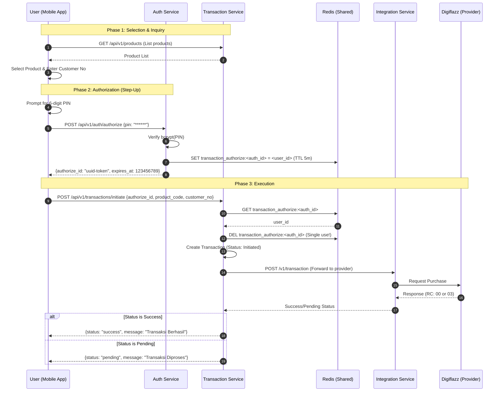

# 🛒 PPOB Transaction Flow Guide

This document details the end-to-end transaction flow in the PPOB system, from product selection to successful checkout, highlighting the secure PIN authorization mechanism.

## 1. High-Level Flow Overview

The transaction process is divided into three main phases:
1.  **Selection & Inquiry**: User selects a product and provides customer details.
2.  **Authorization**: User verifies their identity using a PIN to get a temporary token.
3.  **Execution**: The transaction is initiated and processed by the backend.

---

## 2. Sequence Diagram

---

## 3. Step-by-Step Detail

### Phase 1: Product Selection
- **Discovery**: Mobile app fetches available products from `product-service` (via gateway/transaction-service).
- **Input**: User enters the destination number (Phone Number, PLM ID, etc.).
- **Validation**: Frontend performs initial regex validation on the customer number based on the selected product category.

### Phase 2: Secure PIN Authorization (Step-Up)
To ensure the `transaction-service` never handles sensitive PIN data, we use an **Authorization Token** pattern:
1.  **PIN Entry**: User is prompted for their 6-digit transaction PIN.
2.  **Auth Call**: The app calls `POST /auth/authorize`.
3.  **Token Generation**: `auth-service` verifies the PIN. If correct, it generates a `authorize_id` (UUID).
4.  **State Storage**: The `authorize_id` is stored in a shared **Redis** instance, mapped to the `user_id`, with a short Time-To-Live (5 minutes).

### Phase 3: Transaction Initiation
1.  **Initiation**: The app calls `POST /transactions/initiate`, passing the `authorize_id`.
2.  **Verification**: `transaction-service` checks Redis for the `authorize_id`. 
    - If found and the `user_id` matches, the transaction proceeds.
    - **Single Use**: The token is immediately deleted from Redis after verification to prevent replay attacks.
3.  **Creation**: A transaction record is created in the database with a unique `transaction_id`.
4.  **Integration**: The request is forwarded to the `integration-service`, which communicates with Digiflazz.

---

## 4. Error Handling

| Scenario | Error Code | HTTP Status | User Message |
|---|---|---|---|
| Incorrect PIN | `AUTH_INVALID_CREDENTIALS` | 401 | PIN yang Anda masukkan salah. |
| Expired Auth Token | `AUTH_AUTHORIZE_INVALID` | 401 | Sesi konfirmasi berakhir, silakan masukkan PIN kembali. |
| Reused Auth Token | `AUTH_AUTHORIZE_INVALID` | 401 | Otorisasi tidak valid. |
| Insufficient Balance | `TRANSACTION_INSUFFICIENT_BALANCE` | 400 | Saldo tidak mencukupi. |
| Provider Timeout | `SYSTEM_TIMEOUT` | 504 | Provider sedang sibuk, transaksi diproses (Pending). |

---

## 5. Security Best Practices Implemented

- **Zero-Knowledge PIN**: Only the Auth Service handles PIN hashing and verification.
- **Short-Lived Tokens**: Authorization IDs expire after 5 minutes.
- **Single-Use Tokens**: Tokens are destroyed immediately upon successful transaction initiation.
- **Idempotency**: All transaction requests include an `Idempotency-Key` to prevent duplicate billing in case of network retries.
