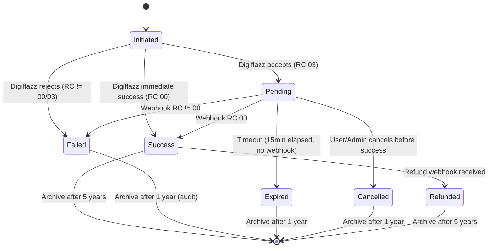

# 🔄 Transaction State Machine for PPOB Application

**Audience:** Backend developers, QA, DevOps  
**Last Updated:** 2026-05-07  
**Status:** Draft — requires validation against Digiflazz webhook behavior

---

## 1. Overview

This document defines the formal state machine for all PPOB transactions. The state machine governs lifecycle from initiation to final terminal state, including all intermediate states, valid transitions, and timeout/recovery logic.

**Scope:** Applies to all transactions initiated via `/transactions/initiate` and processed through the Integration Service with Digiflazz.

---

## 2. State Diagram (Mermaid)



---

## 3. State Definitions

| State | Description | Digiflazz Equivalent | Next Actions | Timeout |
|---|---|---|---|---|
| **Initiated** | Transaction created locally, not yet sent to Digiflazz OR sent but no response yet | — | Call Digiflazz `/transaction` endpoint | 30s (HTTP timeout) |
| **Pending** | Digiflazz accepted transaction with RC 03; awaiting final result via webhook | RC 03 | Wait for webhook OR poll `Cek Status` after 10min | 15min (auto-expire) |
| **Success** | Transaction completed successfully; RC 00 received via webhook or poll | RC 00 | Credit commission, update balance, notify user | — |
| **Failed** | Transaction permanently failed; non-retryable error | RC 02, 40–99 (except 01,70) | Log error, notify user, no balance change | — |
| **Expired** | Pending transaction timed out after 15min without resolution | — | Mark as expired, notify user, no balance deducted (if debit was done, credit back) | 15min |
| **Cancelled** | User or admin cancelled before completion | — | Refund if wallet debited, notify user | — |
| **Refunded** | Digiflazz issued refund (rare, for failed transactions after partial credit) | Refund event | Credit wallet, reverse commission | — |

---

## 4. Transition Rules Table

| From | To | Trigger | Condition | Action / Side Effect | idempotent? |
|---|---|---|---|---|---|
| Initiated | Pending | Digiflazz response RC 03 | `response.status == "Pending"` | Update `transactions.status = 'Pending'`, store `ref_id`; **Do NOT debit wallet yet** (or debit with hold?) | ✅ Yes (ref_id unique) |
| Initiated | Success | Digiflazz response RC 00 | `response.status == "Success"` | Update status, **debit wallet** (if not already), record `sn`, notify | ✅ Yes (ref_id unique) |
| Initiated | Failed | Digiflazz response RC in {02,40–99} except {01,70} | `response.rc not in ["00", "03", "01", "70"]` | Update status, log error, notify user, no wallet change | ✅ Yes |
| Initiated | Failed | Network error / timeout | HTTP request fails, no response received after 3 retries | Update status = 'Failed', error=NETWORK_TIMEOUT, notify | ✅ Yes |
| Pending | Success | Webhook event `update` with RC 00 | `webhook.data.status == "Sukses"` | **Debit wallet** (if not debited earlier), update balance, credit commission, notify | ✅ Yes (webhook idempotent via ref_id) |
| Pending | Failed | Webhook event `update` with RC != 00 | `webhook.data.rc != "00"` | Update status, log error, notify; if wallet was pre-debited, credit back | ✅ Yes |
| Pending | Expired | Timeout: created_at > now() - 15min | Background reconciliation job runs every minute | Update status='Expired', notify user; if wallet debited, credit back with interest? (no) | ✅ Yes |
| Pending | Cancelled | User/Admin cancels via API | `POST /transactions/{id}/cancel` before success | Update status='Cancelled', refund wallet if debited | ✅ Yes (check current status) |
| Success | Refunded | Refund webhook or manual admin action | `Refund` event received from Digiflazz OR admin trigger | Create negative transaction entry (amount = -original), credit wallet, notify | ✅ Yes |
| Failed/Expired/Cancelled | — | — | Terminal states — no outgoing transitions except manual correction via admin | — | — |

---

## 5. Idempotency Guarantees

All state transitions **must be idempotent**. The system may receive duplicate:
- Webhook callbacks (Digiflazz retries for 72h on non-200)
- Poll responses (re-polling same `ref_id`)
- User retry clicks (should not create duplicate transaction)

**Idempotency Mechanism:**
1. **`ref_id` uniqueness** enforced at DB level (`UNIQUE` constraint)
2. **`idempotency_keys` table** for client-initiated retry prevention:
   ```sql
   CREATE TABLE idempotency_keys (
       key_hash VARCHAR(64) PRIMARY KEY, -- SHA256(Idempotency-Key header)
       user_id UUID NOT NULL,
       action VARCHAR(50) NOT NULL, -- 'transaction_initiate'
       resource_id UUID, -- populated after transaction created
       expires_at TIMESTAMP NOT NULL,
       created_at TIMESTAMP DEFAULT CURRENT_TIMESTAMP
   );
   CREATE INDEX idx_idempotency_user_action ON idempotency_keys(user_id, action, expires_at);
   ```
3. Webhook processing: `INSERT ... ON CONFLICT (ref_id) DO UPDATE` but only if status can advance (state machine guard).

---

## 6. Wallet Interaction Timing

**Critical Decision:** When is wallet debited?

**Option A — Debit at Initiation (Current PRD suggests this):**
- Pros: Simple, immediate balance check
- Cons: If transaction pending for 15min, money locked; need refund if expires/fails

**Option B — Debit at Success Only:**
- Pros: No need to refund failed/pending; user sees deduction only when successful
- Cons: Trust risk — user might spend money elsewhere before success; complex if commission needs to be reserved

**Decision: Option A — Debit at Success (not Initiated)** based on business feedback.

**Revised Flow:**
1. `Initiated`: Create transaction record, status='Initiated'. **No wallet change**.
2. `Pending`: Receive RC 03, status='Pending'. **Still no wallet change**.
3. `Success`: Receive RC 00 via webhook, **then debit wallet**, calculate commission, mark `Success`.

**Rationale:** Digiflazz transactions can take up to 15min (PLN postpaid). Locking user's balance during this time is poor UX. Instead, verify balance at webhook time. Risk: User may not have enough balance at success time. Mitigation: Pre-authorization hold at Pending transition (reserve amount with separate `holds` table).

**Revised with Pre-Authorization Hold:**
- At `Initiated → Pending`: Move amount from `available_balance` to `held_balance` in wallet.
- At `Pending → Success`: Deduct from `held_balance`.
- At `Pending → Failed/Expired`: Release `held_balance` back to `available_balance`.

---

## 7. Timeout Configuration

| State | Timeout | Action | Cron Job |
|---|---|---|---|
| Pending | 15 minutes | Transition to `Expired`, release held balance | `reconcile_pending_transactions` runs every minute |
| Initiated (no Digiflazz response) | 30 seconds | Mark as `Failed`, no wallet change | Retry logic within same request (not cron) |
| Refund window | 24 hours after Success | Accept refund webhook | After 24h, reject refunds as stale |

**Reconciliation Job (`reconcile_pending_transactions`):**
```sql
-- Find Pending transactions older than 15min
SELECT * FROM transactions
WHERE status = 'Pending'
  AND created_at < NOW() - INTERVAL '15 minutes';
```
For each:
1. Call Digiflazz `Cek Status` using stored `ref_id`
2. If response received → update accordingly
3. If still no definitive response → set `status='Expired'`, release hold
4. Log reconciliation action in `audit_logs`

**Frequency:** Every minute (cron: `* * * * *`)

---

## 8. Error Handling & Retry Policy

### 8.1 Digiflazz RC → Internal State Mapping

| RC |印尼消息 | Internal Status | Retry? | Retry Strategy | User Message |
|---|---|---|---|---|---|
| 00 | Transaksi Sukses | Success | No | — | "Transaksi berhasil" |
| 01 | Timeout | Initiated → Retry | Yes | Wait 2s, retry same `ref_id` up to 3 times | "Timeout, mencoba ulang..." |
| 02 | Transaksi Gagal | Failed | No | — | "Transaksi gagal" |
| 03 | Transaksi Pending | Pending | No (wait webhook) | Poll after 10min if no webhook | "Transaksi diproses" |
| 40 | Payload Error | Failed | No | Fix request, do not retry | "Format request salah" |
| 41 | Signature tidak valid | Failed | No | Check API key/secret配置 | "Signature tidak valid" |
| 42 | Gagal memproses API Buyer | Failed | No | Contact Digiflazz support | "Gagal memproses" |
| 43 | SKU tidak ditemukan | Failed | No | Check product active | "Produk tidak tersedia" |
| 44 | Saldo tidak cukup | Failed | No | Top up Digiflazz deposit (admin alert) | "Saldo platform habis" |
| 45 | IP tidak dikenali | Failed | No | Add IP to whitelist | "IP tidak terdaftar" |
| 47 | Transaksi sudah terjadi di buyer lain | Failed | No | Wrong customer_no? | "Nomor tujuan sudah digunakan" |
| 49 | Ref ID tidak unik | Failed | No | Generate new ref_id, retry | "ID transaksi double" |
| 50 | Transaksi Tidak Ditemukan | Failed | No | Wrong ref_id on poll | "Transaksi tidak ditemukan" |
| 51 | Nomor Tujuan Diblokir | Failed | No | Contact Digiflazz | "Nomor diblokir" |
| 52 | Prefix Tidak Sesuai | Failed | No | Wrong operator | "Prefix nomor tidak sesuai operator" |
| 53 | Produk Seller Sedang Tidak Tersedia | Failed | No | Try alternative product | "Produk tidak tersedia saat ini" |
| 54 | Nomor Tujuan Salah | Failed | No | Validate number format | "Nomor tujuan salah" |
| 55 | Produk Sedang Gangguan | Failed | No | Try later | "Produk gangguan" |
| 56 | Limit saldo seller | Failed | No | Deprecated — ignore | — |
| 57 | Jumlah Digit Kurang Atau Lebih | Failed | No | Validate length | "Digit nomor salah" |
| 58 | Sedang Cut Off | Failed | No | During cut-off window (00:00–00:15) | "Transaksi cut-off, coba 15 menit lagi" |
| 59 | Tujuan di Luar Wilayah/Cluster | Failed | No | Unsupported area | "Area tidak terjangkau" |
| 60 | Tagihan belum tersedia | Failed | No | Postpaid not yet issued | "Tagihan belum tersedia" |
| 61 | Belum pernah melakukan deposit | Failed | No | Admin: add deposit to Digiflazz account | "Saldo platform kosong" |
| 62 | Seller sedang mengalami gangguan | Failed | Yes | Retry after 30s (max 3) | "Server sedang gangguan" |
| 63 | Tidak support transaksi multi | Failed | No | Use single transaction | "Tidak support multi" |
| 64 | Tarik tiket gagal | Failed | No | Try different nominal | "Gagal tarik tiket" |
| 65 | Limit transaksi multi | Failed | No | Deprecated | — |
| 66 | Cut Off (Perbaikan Sistem Seller) | Failed | No | Scheduled maintenance | " maintenance" |
| 67 | Seller belum ter-verfikasi | Failed | No | Admin: complete verification | "Seller belum verifikasi" |
| 68 | Stok habis | Failed | No | Product out of stock | "Stok habis" |
| 69 | Harga seller lebih besar | Failed | No | Price mismatch — sync again | "Harga bermasalah" |
| 70 | Timeout Dari Biller | Failed → Retry | Yes | Wait 2s, retry (max 3) | "Timeout dari biller, coba lagi" |
| 71 | Produk Sedang Tidak Stabil | Failed | Yes | Retry after 5s (max 2) | "Produk tidak stabil" |
| 72 | Lakukan Unreg Paket Dahulu | Failed | No | User action required | "Unreg paket dulu" |
| 73 | Kwh Melebihi Batas | Failed | No | Electricity usage exceeds limit | "Melebihi batas" |
| 74 | Transaksi Refund | Refunded | No | Refund event | "Transaksi direfund" |
| 80 | Akun Anda telah diblokir oleh Seller | Failed | No | Account blocked by operator | "Akun diblokir" |
| 81 | Seller ini telah diblokir oleh Anda | Failed | No | You blocked seller | "Anda blokir seller" |
| 82 | Akun Anda belum ter-verfikasi | Failed | No | Complete KYC with operator | "Akun belum verifikasi" |
| 83 | Limitasi pengecekan pricelist tercapai | Failed (on sync) | Yes | Wait 4 min (Digiflazz limit 1/5min) | "限 limit pricelist, coba 4 menit lagi" |
| 84 | Nominal tidak valid | Failed | No | Invalid amount | "Nominal tidak valid" |
| 85 | Limitasi transaksi tercapai | Failed | Yes | Wait 60s, retry once | "Rate limit, coba 1 menit lagi" |
| 86 | Limitasi pengecekan nomor PLN tercapai | Failed (on inquiry) | Yes | Wait before inquiry | "Limit cek PLN" |
| 87 | Transaksi E-money wajib kelipatan Rp 1.000 | Failed | No | Round amount to nearest 1000 | "Nominal harus kelipatan 1000" |
| 88 | Akun Anda tidak dapat melakukan aksi ini | Failed | No | Permission denied | "Tidak diperbolehkan" |
| 99 | DF Router Issue | Pending | Yes | Retry after 5s, max 3 | "Router error, coba lagi" |

**Note:** RC 01 (Timeout) and RC 70 (Timeout from Biller) are transient — implement retry with exponential backoff (2s, 4s, 8s). Max 3 attempts. If still failing, mark as `Failed`.

---

## 9. State Transition Validation (Guards)

Before any state transition, validate:

```go
type TransitionValidator struct{}

func (v *TransitionValidator) CanTransition(from, to State, tx *Transaction) error {
    switch from {
    case Initiated:
        if to == Pending && tx.RefID == "" {
            return errors.New("ref_id required")
        }
        if to == Success && tx.Amount == 0 {
            return errors.New("amount must be > 0")
        }
    case Pending:
        if to == Success && time.Since(tx.CreatedAt) > 15*time.Minute {
            return errors.New("cannot succeed after expiry; should be Expired first")
        }
    case Success:
        // Only allow Refund within 24h
        if to == Refunded && time.Since(tx.UpdatedAt) > 24*time.Hour {
            return errors.New("refund window closed")
        }
    }
    return nil
}
```

---

## 10. Webhook Processing

### 10.1 Webhook Event Types

Digiflazz sends `X-Digiflazz-Event` header:
- `create` — Transaction just initiated (RC may be 03 or 00). Usually already handled in synchronous response.
- `update` — Status changed (e.g., Pending → Success). **This is the primary state transition trigger.**

### 10.2 Idempotent Webhook Handler

**Algorithm:**
```go
func handleDigiflazzWebhook(payload WebhookPayload) error {
    // 1. Verify HMAC signature (reject if invalid)
    if !verifyHMAC(payload, secret) {
        return errors.New("invalid signature")
    }

    // 2. Find transaction by ref_id (must exist)
    tx := db.GetTransactionByRefID(payload.Data.RefID)
    if tx == nil {
        // Possibly duplicate or unknown; log and ignore (cannot create transaction from webhook alone)
        return nil
    }

    // 3. Determine new status from payload
    newStatus := mapRCtoStatus(payload.Data.RC)

    // 4. Guard: only allow status advancement (e.g., Pending → Success, never Success → Pending)
    if !canAdvance(tx.Status, newStatus) {
        log.Warn("invalid transition", "from", tx.Status, "to", newStatus, "ref_id", tx.RefID)
        return nil // idempotent ignore
    }

    // 5. Begin transaction
    return db.Transaction(func(txDB *gorm.DB) error {
        // 6. Update transaction with悲观锁 to prevent concurrent webhook processing
        txLocked := txDB.Clauses(clause.Locking{Strength: "UPDATE"}).First(&tx)
        if txLocked.Status != tx.Status {
            // Already updated by another concurrent webhook; skip
            return nil
        }

        tx.Status = newStatus
        tx.DigiflazzResponse = payload.Data
        tx.UpdatedAt = time.Now()
        txDB.Save(&tx)

        // 7. Side effects based on new status
        switch newStatus {
        case Success:
            // Debit wallet (from hold if available), record commission
            err := walletService.DebitForTransaction(tx.ID, tx.Amount)
            if err != nil {
                return err
            }
            // Send push notification
            pushService.Notify(tx.UserID, "transaction_success", map[string]string{
                "transaction_id": tx.ID.String(),
                "amount": fmt.Sprintf("%.2f", tx.SellingPrice),
            })
        case Failed:
            // If wallet was on hold, release
            walletService.ReleaseHold(tx.ID, tx.Amount)
        case Expired:
            walletService.ReleaseHold(tx.ID, tx.Amount)
            pushService.Notify(tx.UserID, "transaction_expired", nil)
        }

        // 8. Audit log
        auditService.Log(AuditEvent{
            UserID: tx.UserID,
            Action: "transaction_status_update",
            Details: map[string]interface{}{
                "transaction_id": tx.ID,
                "from": tx.Status,
                "to": newStatus,
                "ref_id": tx.RefID,
                "webhook_event": payload.Event,
            },
        })

        return nil
    })
}
```

---

## 11. Reconciliation Jobs

### 11.1 Stale Pending Reconciliation (Every Minute)

**Purpose:** Find Pending transactions older than 15min without webhook and mark Expired.

**SQL:**
```sql
UPDATE transactions
SET status = 'Expired',
    updated_at = NOW(),
    digiflazz_response = jsonb_set(
        COALESCE(digiflazz_response, '{}'),
        '{reconciliation}',
        '"Expired due to timeout"'
    )
WHERE status = 'Pending'
  AND created_at < NOW() - INTERVAL '15 minutes'
  AND updated_at < NOW() - INTERVAL '15 minutes'  -- hasn't been updated by webhook
RETURNING *;
```

**Post-action:** For each expired row, release wallet hold.

### 11.2 Balance Reconciliation (Daily at 02:00 AM)

**Purpose:** Verify that sum(`wallet_events`) equals current `wallets.balance` for every wallet.

**Algorithm:**
```sql
SELECT w.wallet_id,
       w.balance AS current_balance,
       COALESCE(SUM(CASE WHEN we.type IN ('credit','refund','topup') THEN we.amount ELSE -we.amount END), 0) AS computed_balance
FROM wallets w
LEFT JOIN wallet_events we ON w.wallet_id = we.wallet_id
GROUP BY w.wallet_id
HAVING w.balance != computed_balance;
```

If mismatches found → alert admin + auto-correct to computed balance (source of truth is `wallet_events`).

**Frequency:** Daily cron `0 2 * * *`

### 11.3 Digiflazz Deposit Sync (Every Hour)

**Purpose:** Verify our internal balance aligns with Digiflazz reported deposit (for accounting reconciliation).

**Call:** `GET /v1/cek-saldo` (Digiflazz)
**Compare:** Digiflazz deposit vs sum of all Mitra main wallet balances.
**Discrepancy:** Alert finance team if drift > Rp 10,000.

---

## 12. State Change Audit Requirements

Every state transition **must** create an `audit_logs` entry:

```go
auditService.Log(AuditEvent{
    UserID:       tx.UserID,        // actor
    Action:       "transaction_update",
    ResourceType: "transaction",
    ResourceID:   tx.ID,
    Details: AuditDetails{
        OldStatus: oldStatus,
        NewStatus: newStatus,
        RefID:     tx.RefID,
        Reason:    "webhook_received", // or 'timeout', 'user_cancel', 'admin_action'
        Metadata: map[string]interface{}{
            "rc":        payloadData.RC,
            "webhook_event": payload.Event,
        },
    },
    IPAddress:    r.RemoteAddr,
    UserAgent:    r.UserAgent(),
    TraceID:      traceID,
    Severity:     "INFO", // or WARNING for unusual transitions (e.g., refund)
})
```

---

## 13. Webhook Retry & Dead Letter

**Digiflazz Behavior:** They retry webhook for 72 hours if our endpoint returns non-2xx.

**Our Endpoint:**
- Always return `200 OK` as soon as we have *accepted* the webhook (after HMAC verification and before processing). This tells Digiflazz "received" and they stop retrying.
- If we return 5xx, Digiflazz retries with exponential backoff.

**Internal Retry:** If webhook processing fails (DB error, wallet error), log error and **still return 200** to stop Digiflazz retries. Then push to internal dead-letter queue (`digiflazz_webhook_dlq`) for manual investigation.

**DLQ Processing:** Admin dashboard shows unprocessed webhooks; admin can replay with correction.

---

## 14. Testing Strategy

### 14.1 Unit Tests
- Test all state transition functions
- Test RC mapping table (every RC code)
- Test timeout logic (use time-freeze library)

### 14.2 Integration Tests
- Mock Digiflazz API with all RC responses
- Simulate webhook delivery, duplicate webhook handling
- Test reconciliation job with fake stale pending transactions

### 14.3 End-to-End Tests
- Full transaction flow from `Initiated` → `Success` (happy path)
- Full transaction flow `Initiated` → `Pending` → `Success` (via webhook)
- Failure path: `Initiated` → `Failed` (RC 68 — out of stock)
- Expiry path: `Pending` (mock time jump 16min) → `Expired`
- Refund path: `Success` → `Refunded`

---

## 15. Monitoring & Alerting

**Metrics to Expose (Prometheus):**
- `transactions_total{status="success|failed|pending|expired"}` — counter
- `transaction_state_transition_duration_seconds{from,to}` — histogram
- `wallet_hold_amount_total` — gauge (sum of all held amounts)
- `digiflazz_webhook_latency_seconds` — histogram
- `reconciliation_job_duration_seconds` — histogram

**Alerts:**
- `transactions_pending_count > 100` (warning) — indicates webhook processing backlog
- `transactions_expired_rate > 0.05` (critical) — high expiry rate, Digiflazz issue or our webhook down
- `wallet_hold_amount > 100000000` (warning) — large amount locked in holds
- `digiflazz_api_error_rate > 0.1` (critical) — Digiflazz unstable

---

## Appendix A — State Machine in Code (Go Pattern)

```go
package transaction

type State string

const (
    StateInitiated  State = "Initiated"
    StatePending    State = "Pending"
    StateSuccess    State = "Success"
    StateFailed     State = "Failed"
    StateExpired    State = "Expired"
    StateCancelled  State = "Cancelled"
    StateRefunded   State = "Refunded"
)

var validTransitions = map[State][]State{
    StateInitiated: {StatePending, StateSuccess, StateFailed},
    StatePending:   {StateSuccess, StateFailed, StateExpired, StateCancelled},
    StateSuccess:   {StateRefunded},
    StateFailed:    {},
    StateExpired:   {},
    StateCancelled: {},
    StateRefunded:  {},
}

func CanTransition(from, to State) bool {
    for _, allowed := range validTransitions[from] {
        if allowed == to {
            return true
        }
    }
    return false
}
```

---

## Appendix B — Migration Script

Add new columns to `transactions` table:

```sql
ALTER TABLE transactions
    ADD COLUMN IF NOT EXISTS hold_released_at TIMESTAMP,
    ADD COLUMN IF NOT EXISTS previous_status VARCHAR(50),
    ADD COLUMN IF NOT EXISTS status_change_reason VARCHAR(255),
    ADD COLUMN IF NOT EXISTS reconciled_at TIMESTAMP;
```

---

## Appendix C — Open Questions

- **Q:** Should we debit wallet at Initiated (reserve) or at Success only?  
  **A:** Debit at Success with pre-authorization hold at Pending (balance split into available + held).

- **Q:** What if user has multiple pending transactions totaling > wallet balance?  
  **A:** Sum of `(available_balance + held_balance)` must never exceed total balance. Hold validation at `Initiated → Pending`: check `available_balance >= amount`; if insufficient, reject early.

- **Q:** Can Mitra cancel staff's pending transaction?  
  **A:** No — only the initiating user (staff) can cancel via app; Mitra cannot cancel staff transactions (audit trail protection).

- **Q:** Refund processing time?  
  **A:** Refund immediate upon verified webhook; commission reversal immediate; notify user.

---

**Next:** Implement this state machine in `TransactionService` with explicit transition guards, add unit tests for all paths, configure reconciliation cron job in Kubernetes (`CronJob` resource).
