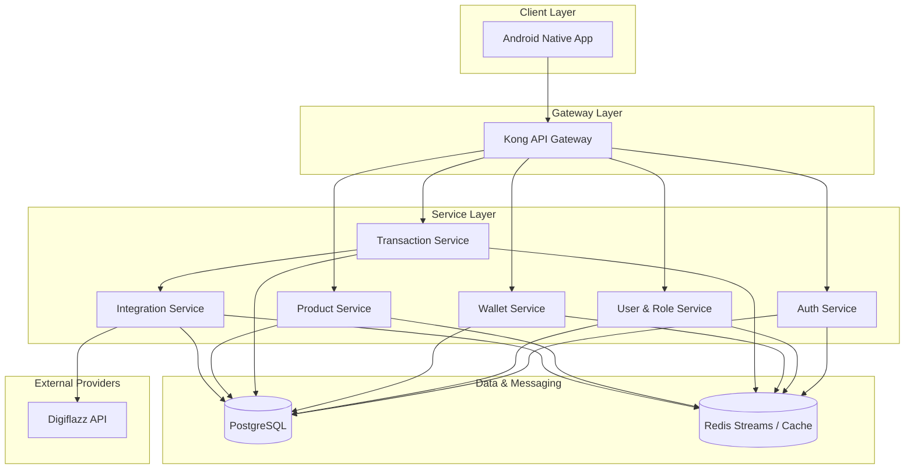

# 🏛️ PPOB System Architecture Overview

## 1. Introduction
This document provides a high-level overview of the PPOB (Payment Point Online Bank) system architecture. The system is designed as a modern, multi-tenant platform for digital product distribution (pulsa, data, PLN, etc.) using a microservices-based approach.

## 2. Architectural Principles
- **Microservices-First:** Domain-driven design with independent services.
- **Event-Driven:** Asynchronous communication via Redis Streams for eventual consistency.
- **Multi-Tenancy:** Unified experience for Mitra (Partners) and Staff with role-based isolation.
- **Financial Integrity:** Event-sourced ledgers for wallet operations.
- **Security-Centric:** Adaptive authentication, trusted devices, and hardware-backed security.

## 3. High-Level Component Diagram
The system consists of several specialized microservices, a mobile application, and a shared data layer.

## 4. Documentation Index
To explore specific architectural areas, please refer to the following documents:

1.  **[Microservices Architecture](01-MICROSERVICES.md):** Detailed breakdown of each service, its responsibilities, and endpoints.
2.  **[Data Architecture](02-DATA-ARCHITECTURE.md):** Database schema, event sourcing logic, and concurrency control.
3.  **[Communication Patterns](03-COMMUNICATION-PATTERNS.md):** Details on gRPC, Event Bus (Redis Streams), and Saga orchestration.
4.  **[Security Architecture](04-SECURITY-ARCHITECTURE.md):** JWT policies, Argon2id/bcrypt hashing, and device trust logic.
5.  **[Infrastructure & Deployment](05-INFRASTRUCTURE.md):** AWS EKS, RDS, ElastiCache, and CI/CD pipelines.
6.  **[Integration Architecture](06-INTEGRATION-ARCHITECTURE.md):** Gateway to external providers like Digiflazz.
7.  **[Mobile Architecture](07-MOBILE-ARCHITECTURE.md):** Android Native (Kotlin + Compose) architecture and offline-first strategy.

## 5. Technology Stack
- **Backend:** Go (Golang)
- **Frontend:** Kotlin (Jetpack Compose)
- **Database:** PostgreSQL 15
- **Caching/Messaging:** Redis 7.2
- **Infrastructure:** AWS (EKS, RDS, ElastiCache)
- **External API:** Digiflazz Gateway
