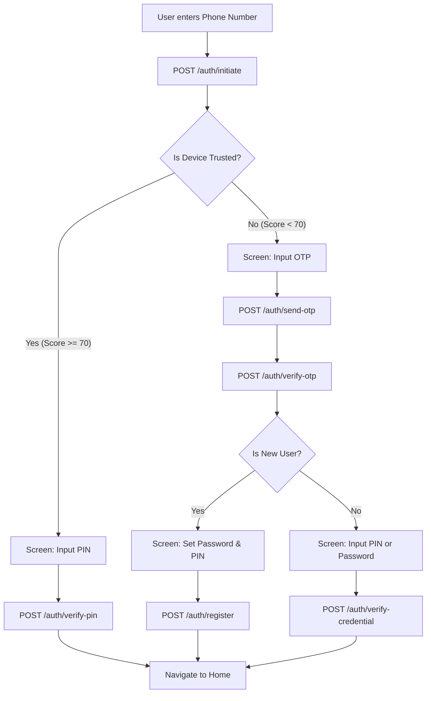

# 🔑 Authentication & Registration Flow

## 1. Overview
The PPOB system implements an **Adaptive Authentication** flow. The level of verification required depends on the device trust score.

## 2. Adaptive Login Flow
The entry point for all users is the `POST /auth/initiate` endpoint.

## 3. New User Registration
1.  **Phone & OTP:** User provides phone number. System sends 6-digit OTP via SMS.
2.  **Verification:** User submits OTP. System validates and returns a `verified_request_id`.
3.  **Credentials:** User sets a login password (bcrypt) and a transaction PIN (Argon2id).
4.  **Completion:** System creates the user record, default `Mitra` role, and main wallet.

## 4. Device Trust & Fingerprinting
- **Signals:** `device_id`, `user_agent`, `ip_subnet`, `app_version`, `install_ts`.
- **Trust Scoring:** Points are awarded for recurring logins, age of installation, and IP consistency.
- **Auto-Promotion:** Successfully logging in with Password + OTP on a new device automatically promotes that device to "Trusted" for future PIN-only logins.

## 5. Token Management
- **Access Token:** 15-minute lifespan, stored in memory.
- **Refresh Token:** 1-day (Staff) or 7-day (Mitra) lifespan, stored in `EncryptedSharedPreferences`.
- **Rotation:** Refreshing an access token consumes the old refresh token and issues a new one.
