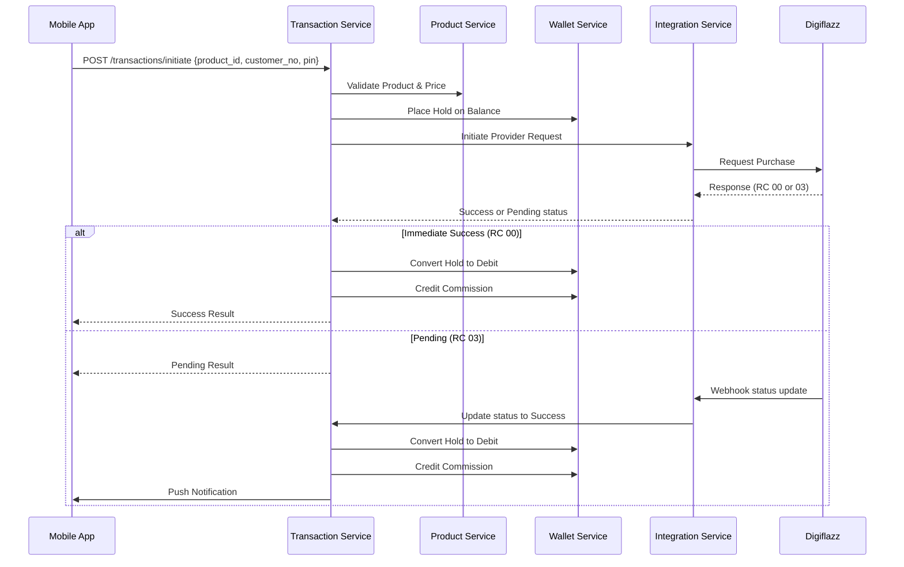

# 🛒 Transaction Lifecycle Flow

## 1. Overview
Transactions go through a rigorous validation and state management process to ensure financial correctness and idempotency across microservices.

## 2. General Transaction Flow
This flow applies to both Prepaid and Postpaid services.

## 3. Product-Specific Logic

### 3.1 Prepaid Flow
Prepaid transactions are usually completed in a single synchronous call. The `ref_id` is generated by the Transaction Service and must be unique.

### 3.2 Postpaid Flow (Two-Step)
1.  **Inquiry:** App calls initiate. System fetches bill details (amount, admin fee, customer name) from provider. Result is stored in `postpaid_inquiries` for 24h.
2.  **Payment:** User confirms payment. System reuse the same `ref_id` from the inquiry to execute the final `pay-pasca` command.

## 4. State Machine Guards
Transactions move through the following states:
`Initiated` → `Pending` → `Success` | `Failed` | `Expired` | `Cancelled`

- Status transitions are **one-way**. A `Success` transaction can never revert to `Pending`.
- A `Success` transaction can only transition to `Refunded` within a 24-hour window if a refund webhook is received.

## 5. Security & Idempotency
- **Authorization Token:** PIN verification generates a short-lived (5min) single-use token in Redis to authorize the `/initiate` call.
- **Idempotency Key:** Required header for `/initiate`. Prevents double-billing if the user retries a timed-out request.
- **Wallet Hold:** Prevents "Double Spend" by reserving funds as soon as the transaction is accepted by the provider.
