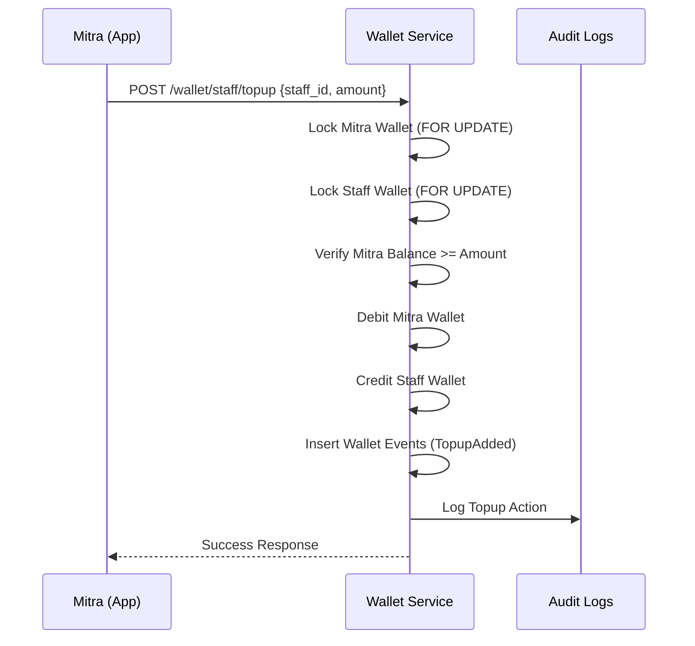

# 👥 Staff Management Flow

## 1. Overview
Mitra (Partners) can manage their business by adding Staff members. This creates a multi-tenant hierarchy where Staff perform transactions funded by the Mitra.

## 2. Staff Onboarding Flow
1.  **Creation:** Mitra provides the Staff's phone number, name, and initial credentials.
2.  **Role Assignment:** System assigns the `Staff` role and links it to the Mitra (`assigned_by` field).
3.  **Wallet Creation:** A database trigger automatically creates a Staff sub-wallet linked to the Mitra's main wallet.
4.  **Margin Configuration:** Mitra sets the revenue sharing scheme (Fixed Allowance or Margin Share) for the Staff.

## 3. Margin & Commission Schemes
- **Fixed Allowance:** Staff gets a fixed amount (e.g., Rp 1,000) for every successful transaction.
- **Margin Share:** Staff gets a percentage (default 60%) of the total margin (`Selling Price - Platform Price`).
- **Overrides:** Mitra can set specific margin rules for individual products to override global staff settings.

## 4. Staff Top-Up Flow
Staff cannot top up their own wallets via external payment methods. They must be funded by their Mitra.

## 5. Daily Limits & Fraud Control
Staff are subject to daily limits to mitigate financial exposure:
- **Transaction Count:** Max 50 transactions per day (default).
- **Transaction Amount:** Max Rp 5,000,000 turnover per day (default).
- **Enforcement:** Limits are checked atomically during transaction initiation. If exceeded, the transaction is blocked.
- **Reset:** Limits reset automatically at 00:00 WIB daily.
