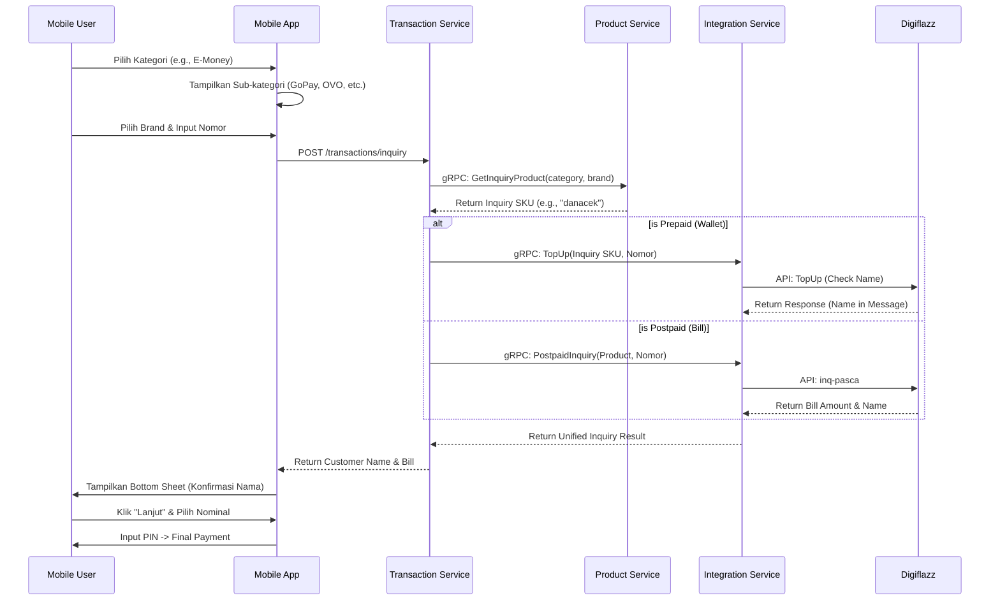

# Universal Inquiry Flow Plan

## 1. Background & Motivation
Existing transaction flows (especially for E-Wallets and PLN) were lacking a verification step. Users often experienced anxiety about whether they were sending funds to the correct account or didn't know the exact bill amount for postpaid services. The goal is to implement a universal "Inquiry" step that validates customer details before any financial commitment.

## 2. Scope
- **Backend:** Update Product and Transaction services to handle inquiry logic for both Prepaid (E-Money name checks) and Postpaid (PLN/BPJS bill checks).
- **Database:** Enhance schema to flag categories and products that require or provide inquiry.
- **Mobile:** Implement a multi-step UI flow: Category -> Sub-category/Brand -> Input ID -> Inquiry Result -> Selection -> Payment.

## 3. Flow Diagram

## 4. Implementation Details

### 4.1 Database & Backend (Foundational)
- **Migration (022):** Added `needs_inquiry` to `categories` and `is_inquiry` to `products`.
- **Product Service:** 
    - Updated Models and DTOs.
    - Implemented `GetInquiryProduct` logic to find the "Check Name" SKU for a specific brand.
- **Integration Service:** Added `InquiryDigiflazz` to handle `inq-pasca` commands.
- **Transaction Service:** 
    - Added `POST /transactions/inquiry` endpoint.
    - Implemented branching logic to handle Prepaid Inquiry (using TopUp on cek-SKU) and Postpaid Inquiry.

### 4.2 Mobile UI (UX Transformation)
- **Brand Selection:** Added a brand selection grid for categories like PLN and E-Money.
- **CheckoutStep State Machine:** Expanded flow to include `INQUIRY` -> `SUMMARY` -> `PIN`.
- **Inquiry Integration:** Automatically triggers inquiry when a number is entered in a `needs_inquiry` category.
- **Dynamic Feedback:** Added a loading spinner and formatted currency in the `TransactionResultScreen`.

## 5. Verification
- [x] Run `make build` to ensure microservices compile.
- [x] Verified category metadata exposed via API.
- [x] Verified mobile UI branching logic (Prepaid vs Inquiry categories).
- [x] Reverted `gradle.properties` to ensure no environment leak.

## 6. Completion Note
This plan is fully implemented. Future improvements will include more granular bill detail mapping (Admin fee, Period, etc.) once provider integration tests are conducted with real accounts.
